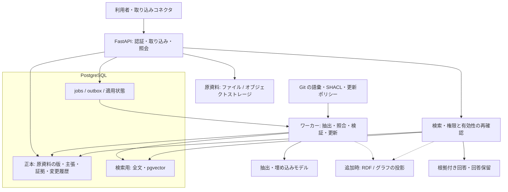

# オントロジー・ナレッジシステムの推奨設計

[ドキュメントガイド](../README.md) / [調査トップ](../research/README.md) / [資料台帳](../research/sources.md)

**作成日: 2026-09-28 / 状態: 調査に基づく実装提案。** 汎用の知識基盤、個人向けの長期記憶・アシスタント、特定業務・専門分野のナレッジグラフを対象にする。会話・文書・ツール結果から知識を蓄積し、根拠付きで検索・訂正・再利用する共通基盤と、用途別に追加・変更する構成をまとめる。利用者数、データ量、実行環境は未確定である。

推奨する初期構成は、**Python + FastAPI、PostgreSQL + pgvector、小さな RDF/OWL オントロジー、RDFLib + pySHACL、非同期ワーカー**である。PostgreSQL に主張・証拠・変更履歴の正本を置き、全文・ベクトル・必要に応じたグラフを検索用に構築する。原資料から回答までの対応と、訂正後の状態を説明できる構成を優先する。

この推奨は[設計の選択肢と検証仮説](../research/design-directions.md)の A 案を中心に、C 案の語彙・検証を組み合わせた設計判断である。統合システムの性能や依存バージョンの互換性は未実測であり、後述する評価で採否を決める。RDF を中心とする業務には別の構成を示す。

## 目次

- [設計方針と調査からの判断](#decisions)
- [知識を表すための概念](#concepts)
- [推奨技術スタック](#stack)
- [システム構成と責務](#architecture)
- [三つの用途に適用する構成](#usage-profiles)
- [オントロジーの作り方](#ontology)
- [正本のデータモデル](#data-model)
- [取り込み・更新・検索の処理](#pipelines)
- [訂正・撤回・削除の扱い](#lifecycle)
- [APIと運用上の契約](#contracts)
- [別構成を選ぶ条件](#alternatives)
- [実装順序と評価基準](#roadmap)

<a id="decisions"></a>

## 設計方針と調査からの判断

| 調査から得た判断 | 採用する設計 | 根拠となる調査 |
|---|---|---|
| メモリー製品ごとに保存単位と更新の意味が違う | 自分たちの主張・証拠・更新操作を定義し、製品との接続はアダプターにする | [システム比較](../research/systems/README.md) |
| 語彙の一致、型検査、論理的含意、事実の正しさは異なる | オントロジー、SHACL、更新ポリシー、根拠評価を別の責務にする | [オントロジーと標準](../research/foundations/ontology.md) |
| 時間付きエッジだけで全訂正履歴の再現は保証されない | 世界での有効期間と、システムがその認識を持った期間を記録する | [知識更新](../research/foundations/knowledge-updates.md)、[構造化メモリー](../research/systems/structured-memory.md) |
| 原資料の撤回は主張・要約・索引にも影響する | 証拠と派生の依存関係を保持し、影響範囲を再評価する | [知識更新](../research/foundations/knowledge-updates.md) |
| 検索精度と更新の正しさは別の能力 | 更新操作、根拠回収、回答、費用を個別に測る | [評価方法](../research/evaluation.md) |
| グラフや型の追加には運用・抽出の費用が伴う | 全文＋ベクトルを基準線にし、改善する問いに絞って構造を加える | [設計仮説](../research/design-directions.md) |

初期の優先順位は、**根拠を保持する → 更新を正しく扱う → 必要な知識を検索する → 意味的制約と推論を広げる**。オントロジー自体は最初から小さく定義し、推論の範囲を段階的に増やす。

<a id="concepts"></a>

## 知識を表すための概念

| 概念 | この設計での意味 | 実装への反映 |
|---|---|---|
| 原資料と観測 | 誰が、いつ、どこで述べたかという記録 | SourceRevision と原文の範囲を保存する |
| 実体とメンション | 実世界の対象と、その対象への文章中の言及 | Entity と Mention を分離し、同姓同名や統合の取り消しを扱う |
| 主張 | 対象・関係・値・条件を持つ、採否を検討する単位 | Assertion に否定、仮定、予定、視点を付ける |
| オントロジー | クラス・関係・意味・公理を共有する語彙体系 | 安定した IRI と型の階層を定義する。業務語彙を小さく始める |
| 制約 | データが満たすべき構造と整合条件 | Pydantic、SHACL、DB 制約で段階的に検査する |
| 更新ポリシー | 新情報に対して何を残し、何を置換するか | 関係ごとの単値・多値、時間、情報源の優先順位を定義する |
| 双時間 | 世界で有効な期間と、記録上そう認識していた期間 | `valid_from/to` と `system_from/to` を分ける |
| 来歴と真理維持 | 結論の根拠と、その変更による影響を追う考え方 | EvidenceSupport と Derivation を使って再評価する |
| 正本と検索用データ | 採用状態を決める記録と、検索を速くする派生物 | 索引・要約・グラフは正本から再構築できるようにする |
| 不確実性 | 不明、未確認、対立、棄却を表す状態 | 一つの confidence 値だけで真偽や採用を決めない |

OWL は開世界の意味論を採り、未記載から直ちに偽を導かない。必須フィールドの欠落は SHACL や DB 制約で検査し、事実の正しさは根拠と更新方針で判断する。`owl:sameAs` は強い同一性なので、名前や埋め込みが似た候補の表現には使わない。[S-OWL] [S-SHACL]

`extraction_confidence`、情報源への信頼、検索の関連度、行動に役立った度合いは別項目にする。たとえば「検索で高順位だった情報」が「信頼できる最新の事実」とは限らない。経験・手順の有用性を学習する場合も、主張の根拠評価と分ける。

<a id="stack"></a>

## 推奨技術スタック

### 初期構成に含めるもの

| 層 | 推奨技術 | 採用理由と実装方針 |
|---|---|---|
| アプリケーション | Python、FastAPI、Pydantic | 抽出・RDF 処理と API を同じ言語で実装する。入力と変更計画を型付きで検査する。[D-FASTAPI] [D-PYDANTIC] |
| 正本 | PostgreSQL | 主張、根拠、状態変更、ジョブをトランザクションで管理する。双時間と採否の意味論はアプリで実装する |
| DB アクセスと移行 | SQLAlchemy、Alembic | トランザクション境界と SQL schema の変更履歴を管理する。オントロジーの版とは別に記録する。[D-SQLALCHEMY] [D-ALEMBIC] |
| オントロジー | RDF/OWL の小さな語彙、Turtle、Git | 人がレビューできる語彙・公理を版管理する。PROV-O、SKOS などを必要な部分に利用する。[S-PROV] [S-SKOS] |
| RDF 操作と検証 | RDFLib、pySHACL | SQL 上の変更候補を RDF に写し、保存前に語彙・形状を検査する。初期は検証対象を変更箇所と関連するデータに絞る。[D-RDFLIB] [D-PYSHACL] |
| 意味検索 | pgvector | 正本と同じ DB に埋め込みを置く。まず exact search を基準にし、必要になったら HNSW と比較する。[D-PGV] |
| 日本語の語彙検索 | SudachiPy + PostgreSQL の全文検索 | 文書・質問に同じ分かち書きを適用する。辞書・正規化・分割モードを固定する。[D-SUDACHI] [D-PG-FTS] |
| 抽出・回答モデル | モデル交換用の薄いアダプターと提供者 SDK | 抽出、回答、埋め込みの契約を分け、モデル ID・prompt・schema を固定する。構造化出力の成功後にも根拠との対応を検査する |
| 埋め込みの比較基準 | BGE-M3 の dense 表現 | 多言語の公開モデルを再現可能な比較基準にする。日本語での採用判断は手元の評価に基づく。[D-BGE] |
| 背景処理 | Python ワーカー、PostgreSQL の jobs / outbox テーブル | 取り込みと検索用データの更新を非同期化する。再試行・完了状態を永続化する。[D-PG-SELECT] |
| 原資料の保存 | 開発時はファイル、共有運用ではオブジェクトストレージ | バイナリ原本を保存し、DB に保存先・hash・版・権限を持つ。テナントをまたぐ重複排除は初期に行わない |
| 依存固定と実行 | uv の lockfile、コンテナ、開発用 Compose | Python の対応版、パッケージ、DB 拡張、モデルの revision を検証して固定する。[D-UV] |

全文検索は、分かち書き済みテキストを `to_tsvector('simple', ...)` に渡す構成を候補にする。質問側も同じ辞書・モードで処理し、識別子・複合語の正解例で確認する。PostgreSQL の `ts_rank` / `ts_rank_cd` を BM25 として報告しない。[D-PG-FTS]

BGE-M3 の dense 出力は 1024 次元だが、別モデルへ交換できるよう、埋め込みにはモデルと revision、次元数、正規化方法を記録する。異なるモデルのベクトルを同じ検索空間に混在させず、再計算した索引を検証してから切り替える。[D-BGE]

### 要件が現れた時に追加するもの

| 追加技術 | 導入する条件 | 追加する責務・費用 |
|---|---|---|
| Docling | PDF、表、ページ座標を伴う入力が増える | 原本と抽出位置の対応、OCR の誤り、parser の版を管理する。[D-DOCLING] |
| Protégé、ROBOT | 語彙を専門家と編集し、検査を自動化する | 用語の定義、廃止・置換、リリース手順を運用する。[D-PROTEGE] [D-ROBOT] |
| OntoGPT / LinkML | 既存の専門語彙への grounding が主要要件になる | 抽出結果の識別子と原文の対応を検証する。[D-ONTOGPT] |
| Oxigraph | SPARQL や RDF の問い合わせを小さく試す | 対象 snapshot の RDF を投影し、正本との更新状態を追う。[D-OXI] |
| Apache Jena / Fuseki | SPARQL を共有サービスとして運用し、ルール推論を使う | Java 基盤、索引、認証との接続、推論対象範囲を管理する。[D-JENA] [D-JENARULE] |
| 再ランキング、階層要約 | 基準線の候補精度や文脈予算に明確な問題がある | モデル呼び出し費用と、要約の来歴・失効処理を追加する |
| 専用ベクトル DB、専用ジョブ基盤 | 実測で DB 負荷・待ち時間・分散実行が制約になる | 外部索引との整合性、再送、監視対象が増える。候補は[実装基盤の調査](../research/implementation/infrastructure.md)から比較する |

pySHACL の推論設定は `none`、`rdfs`、`owlrl` などから明示して固定する。最初は推論なしの検証を基準にし、クラス階層やルールによる改善を別に評価する。Jena の組み込み OWL 推論も対応する部分集合に制約があるため、完全な OWL DL 推論が必要なら、採用する公理と reasoner を別途選定する。[D-PYSHACL] [D-JENARULE]

<a id="architecture"></a>

## システム構成と責務

初期は、一つのコードベースを API プロセスとワーカープロセスとして動かす。モジュールを分けた単一アプリケーションから始め、PostgreSQL と原資料の保存領域を共有する。



| モジュール | 担う責務 |
|---|---|
| ingestion | 原資料の版、抽出位置、取り込みジョブを作る |
| ontology | 語彙・shape・更新ポリシーの版を読み込み、同じ bundle を各処理へ渡す |
| extraction | 原文からメンション・主張候補・根拠範囲を抽出する |
| resolution | 実体候補の照合、同定・統合・分割の履歴を扱う |
| knowledge | 更新計画を検証し、正本の状態変更を一つのトランザクションで確定する |
| projection | 全文、ベクトル、RDF、要約を更新し、適用した変更を記録する |
| retrieval | 問い、時点、利用者に応じて候補を取得し、根拠を揃える |
| evaluation | 正本の更新、検索、回答、費用を同じ入力履歴で比較する |

正本には二種類ある。**知識の採用状態は PostgreSQL、語彙・shape・更新ポリシーの定義は Git で版管理した bundle**を正本とする。稼働時には bundle の内容と hash を保存し、どの版で生成・採用したかを記録する。RDF の検索用データを直接編集する API は初期構成に含めず、変更は knowledge モジュールへ戻す。

原資料をオブジェクトストレージに保存する場合、DB と一つのトランザクションにはならない。保存済みオブジェクトを確認してから DB の参照とジョブを確定し、確定に失敗した未参照オブジェクトは後で回収する。保存先が確定する前に抽出ジョブを実行可能にしない。

<a id="usage-profiles"></a>

## 三つの用途に適用する構成

三つの用途で、原資料、証拠、版、同定、訂正、検索の契約を共有する。違いが大きいのは、記憶単位、語彙の厳密さ、読み出し方、正解を判断する基準である。

| 設計軸 | 汎用の知識基盤 | 個人の長期記憶・アシスタント | 特定業務・専門分野 |
|---|---|---|---|
| 主な入力 | 文書、会話、ツール結果、外部システムの変更 | 対話、個人ノート、予定、作業結果 | 業務データ、専門文書、標準語彙、承認済み記録 |
| 中心となる単位 | 原資料、主張、実体、出来事 | エピソード、人物像、嗜好、予定、経験・手順 | 型付き実体、関係、イベント、主張、公理 |
| オントロジー | 小さな共通語彙と追加可能なドメイン語彙 | 人物・時間・状況と、記憶の用途を示す軽い語彙 | 専門家が管理する語彙・公理・shape・外部識別子 |
| 初期の保存基盤 | PostgreSQL を正本とする推奨構成 | 推奨構成を一利用者に縮小。必要ならノートを編集面にする | 業務更新が中心なら PostgreSQL、RDF の意味論・交換が中心なら RDF ストア |
| 主な読み出し | SQL、全文・ベクトル、必要な関係の探索 | 小さな常駐 profile と、必要時の記憶検索 | SQL / SPARQL、制約付き検索、必要な推論 |
| 更新の中心 | 文書改訂、情報源の競合、根拠撤回 | 状態変化、訂正、嗜好の文脈、忘却、経験の再評価 | 業務イベント、承認、語彙移行、ルール変更 |
| 評価の中心 | 根拠回収、回答、訂正、費用 | 個人化の適切さ、時間、撤回、行動への有用性 | competency questions、制約・含意の正しさ、監査可能性 |

### 汎用の知識基盤

PostgreSQL を正本にし、原文の検索と構造化主張の検索を併用する。構造化に向く人・組織・関係・日時を主張へ抽出し、説明文、議論、曖昧な記述は原文のまま検索可能にする。抽出に失敗した内容を消さず、「未構造化だが出典を持つ情報」として利用できるようにする。

取り込み元ごとに source ID、更新検出、削除通知、再取得の契約を決める。外部システムが正本である業務データは、複製した時点と参照先を保持する。鮮度が特に必要な問いでは元システムへの照会を選択できるようにし、取得結果も時刻付きの観測として扱う。

段階的に増えるドメイン語彙は名前空間で分け、同じ語でも分野によって意味が違う場合は別 IRI にする。LLM が作った新しい分類や関係は候補として評価し、既存の competency questions とデータへの影響を確認してから語彙へ取り込む。これにより、柔軟な取り込みと意味の安定性を両立させる。

### 個人の長期記憶・アシスタント

共通の Source / Assertion / Evidence を使いながら、読み出し先に応じて記憶を分ける。

| 記憶の種類 | 保存・更新の方針 | アシスタントでの使い方 |
|---|---|---|
| エピソード | 会話や作業結果を日時・参加者・根拠付きで保存 | 以前の文脈や失敗の経緯を検索する |
| 事実・嗜好 | 有効期間と状況を持つ主張として保持 | 必要な条件に合う情報だけを個人化に使う |
| profile / 観察要約 | 採用済み主張から作る派生物として版管理 | 小さな token 予算の常駐文脈として使う |
| 予定・意図 | 予定と実行結果を別に保持 | 期限を過ぎた予定を実現済みと推定しない |
| 経験・手順 | 適用条件、結果、利用した環境・道具の版を持つ | 次の行動候補に使い、有用性と事実の確度を別に更新する |
| 作業状態 | セッション・タスクの進行状態として保持 | 長期の人物情報への自動昇格を避ける |

明示的な自己申告、行動からの推定、別の観測者による判断を区別する。「いつも短い回答を好む」という推定を、本人が確認した普遍的な事実に置き換えない。人物像の更新も支持する観測と適用する文脈を残す。

初期は profile の常駐配置と全文・ベクトル検索を比較し、個人の情報量が増えた時に関係探索を加える。profile やノートを人が修正した場合は、それを新しい情報源・訂正要求として正本へ反映する。要約だけを直接書き換えて次の再生成で失う構成にしない。

エージェントとは HTTP API、必要なら MCP を介して接続する。読み出し、記憶の候補追加、明示的な訂正・消去を別の操作にし、すべて共通の knowledge モジュールを通す。会話外の行動に利用する手順には適用条件と権限を持たせる。比較対象は[Letta・Basic Memory・Mastra](../research/systems/agent-memory.md)と[Hindsight](../research/systems/structured-memory.md)で、回答 QA と行動タスクを別々に評価する。

### 特定業務・専門分野のナレッジグラフ

業務で答えるべき問いと、許される操作を先に確定し、専門家と語彙・関係・制約を定義する。既存の専門語彙を使う場合も、取り込むモジュール、版、外部識別子との対応を固定する。上位オントロジーは、分類や相互運用に必要な範囲を選び、分野に合う定義を優先する。

業務上の更新・履歴・権限が主な難しさなら、PostgreSQL の正本と RDF 投影を使う。SPARQL によるデータ連携や RDF 自体の編集・制約が業務の中心なら、RDF ストアへ正本の責務を移す。この場合も、主張・証拠・双時間・変更履歴の契約を RDF 上に定義する。SQL と RDF の両方を独立に編集可能な正本にはしない。

推論は、型階層、関係の包含、業務ルール、必要な OWL 公理という順に範囲を明示する。採用する ontology の profile に合う reasoner を選び、既知の含意・非含意・矛盾の例で確認する。ルールの結果にも入力 revision と rule version を対応付け、原資料や公理が変更された時に影響する結論を再評価する。

確定した業務知識へ反映する条件は、情報源の権威、制約検査、必要な担当者のレビューで定義する。抽出できなかった項目や未知の語彙は保留として可視化する。厳しい制約で誤りを減らすだけでなく、正しい新概念を取りこぼしていないかも測る。

三つの用途を一つのサービスで扱う場合も、テナント、視点、業務範囲、語彙の bundle を分ける。個人の推定や未確認のメモが、業務上の確定知識へ自動的に昇格する経路を作らず、共有する時には出典と採用条件を検証する。

<a id="ontology"></a>

## オントロジーの作り方

### 答えたい問いから語彙を決める

まず、システムが答えるべき問いを具体例と期待結果で定義する。これを competency questions として、オントロジーの変更時にも使う。

| 問い | 必要な概念・関係 |
|---|---|
| この人の現在の主な勤務先はどこか | Person、Organization、主な勤務先、有効期間、観測者 |
| 4 月の勤務先を、5 月時点の認識で答えられるか | 有効時刻、記録時刻、主張の版 |
| その回答はどの資料のどの部分に基づくか | SourceRevision、SourceSpan、EvidenceSupport |
| 一つの記事が撤回されたら、どの結論を見直すか | 主張の支持関係、Derivation |
| 同じ名前の二人を誤統合したら元に戻せるか | Mention、実体同定の判断、統合・分割履歴 |

コア語彙は、`Entity`、`Event`、`AssertionRevision`、`SourceRevision`、`EvidenceSupport`、`Derivation` を中心にする。`Person`、`Organization`、雇用や所属などの関係はドメイン用モジュールへ分ける。すべての対象を汎用的な `relatedTo` で結ばず、必要な問いに意味を持つ関係を定義する。

既存語彙は、来歴に PROV-O、用語のラベル・同義語・分類に SKOS、交換用の表現に JSON-LD を使う。PROV-O の Entity / Activity / Agent は、資料・抽出処理・作成者などの対応を表せる。一方、主張の採用状態や更新方針はアプリ独自の語彙として定義する。[S-PROV] [S-SKOS] [S-JSONLD]

### 語彙、制約、更新方針を一つのリリースとして管理する

次は実装時に作るファイル構成の例であり、このリポジトリに実装済みという意味ではない。

```text
ontology/
  core.ttl                    # 主張、原資料、根拠、派生
  domains/employment.ttl      # 人物、組織、雇用に関する意味
  shapes/assertion.ttl       # 保存可能な主張の構造
  policies/lifecycle.yaml    # 関係ごとの更新・併存ルール
  competency-questions.yaml  # 問いと期待する答え
  examples/                  # 正常例と違反例
  manifest.json              # 各ファイルの版・hash・依存する語彙
```

用語の IRI は安定させ、表示名の変更で識別子を変えない。意味を変更する場合は、廃止語・置換先・既存データへの移行を定義する。`ontology_version`、`shape_version`、`policy_version` は bundle で対応付ける。Pydantic の型と SHACL を手動で管理する段階では、同じ正常・異常例を両方に通してずれを検出する。形式が違うだけで同じ意味になるとは仮定しない。

更新ポリシーの例は次のようになる。`primaryEmployer` は、この用途で定義した「主な勤務先」であり、一般の所属関係 `worksFor` を単値に制限するものではない。

```yaml
predicate: https://example.org/grimoire/primaryEmployer
subject_type: Person
object_type: Organization
slot_key: [tenant_id, viewpoint_id, subject_id, predicate, employment_context]
cardinality: at_most_one_at_a_valid_time
world_change: close_previous_interval_and_add_assertion
correction: append_revisions_for_affected_assertions
conflicting_sources: keep_disputed_until_resolved
unknown_term: stage_as_candidate
```

これは本提案の設定形式であり、既存ライブラリへそのまま渡せる仕様ではない。多値を許す関係、複数の視点、予定と実現済みの事実には別の方針を設定する。

### SHACL と更新検査の境界

次は、直接抽出した主張の構造を検査する shape の抜粋である。`kg:` は例示用の独自語彙で、完全なオントロジーや全制約を定義したものではない。

```turtle
@prefix kg: <https://example.org/grimoire/> .
@prefix sh: <http://www.w3.org/ns/shacl#> .

kg:ExtractedAssertionShape a sh:NodeShape ;
  sh:targetClass kg:ExtractedAssertionRevision ;
  sh:property [
    sh:path kg:subject ;
    sh:minCount 1 ; sh:maxCount 1 ; sh:nodeKind sh:IRI
  ] ;
  sh:property [
    sh:path kg:predicate ;
    sh:minCount 1 ; sh:maxCount 1 ; sh:nodeKind sh:IRI
  ] ;
  sh:property [
    sh:path kg:object ;
    sh:minCount 1 ; sh:maxCount 1
  ] ;
  sh:property [
    sh:path kg:support ;
    sh:minCount 1 ; sh:class kg:EvidenceSupport
  ] .
```

SHACL は与えた RDF グラフを検証する。関係ごとの subject/object の型、許可語彙、時間の整合などは追加の shape・アプリ検査で補う。推論由来の主張には Derivation を要求する別の shape を用意する。支持レコードが存在する検査と、原文が実際に主張を支持する検査は別工程にする。[S-SHACL]

単値関係の重複や実体統合を検査する場合、候補一件だけでなく、影響する既存主張と型情報も検証対象に含める。検証中にその範囲の版が変わった場合は、保存時に競合として再検査する。未知語は候補領域に残し、抽出 LLM が本番の語彙や公理を直接変更する経路は設けない。

<a id="data-model"></a>

## 正本のデータモデル

| レコード | 主な情報 | 保持する理由 |
|---|---|---|
| Source / SourceRevision | 識別子、原本 URI、hash、作成・取得時刻、権限 | 同じ資料の訂正、再抽出、削除の起点 |
| SourceSpan | 資料の版、文字範囲、ページ・画像座標・音声区間 | 回答から原資料の該当部分へ戻る |
| Entity / Mention | 安定 ID、型、名称、原文中の言及 | 名前と対象を分離する |
| ResolutionDecision | メンションと実体の対応、根拠、判断の版 | 統合の取り消しや別人への付け替えを追う |
| Assertion / AssertionRevision | 主語、関係、値、条件、否定・様態、視点、二つの期間、状態 | 時点と認識を区別した主張を保持する |
| EvidenceSupport | 主張の版、SourceSpan、支持・反証の別、出典系列 | 複数根拠と転載を区別する |
| Derivation | 入力 revision 集合、出力、rule/model/prompt の版 | 派生した主張・要約の再評価範囲を特定する |
| OntologyBundle | ontology / shape / policy の版と hash | どの意味・制約・方針で採用したかを再現する |
| ChangeSet | 操作種別、変更前後の版、理由、実行主体 | 複数主張にまたがる訂正を一つの変更として追う |
| Job / OutboxEvent | 入力、冪等性キー、状態、再試行、変更 ID | 処理の中断・再実行を扱う |
| ProjectionState | 対象 revision、モデル、投影先、適用した変更 ID | 索引の遅延、再構築、切り替えを管理する |

主語・関係・型付きの値、テナント、状態、時刻、外部キーは通常の列に置く。ドメインごとに異なる qualifier は JSONB を併用する。すべてを自由形式 JSONB にすると、制約・索引・移行の対象が曖昧になる。実体参照と literal 値は排他的に持ち、テナントを含む参照整合性を DB で検査する。

`Assertion` は追跡用の ID、`AssertionRevision` はある認識時点での内容である。値が変わる世界の変化では、旧主張を閉じて新しい主張を関連付ける。日付の訂正などでは、影響する主張の新しい版を作る。通常の訂正で過去版の内容を上書きせず、旧版の `system_to` を閉じる履歴管理操作と新しい版の追加を同一トランザクションで行う。

状態には `candidate`、`accepted`、`disputed`、`retracted` などを定義し、原資料から抽出したものと推論・要約で生成したものを区別する。予定・仮定・引用は `modality`、明示的否定は `polarity` で保持する。「値がない」と「否定された」は同じ状態にしない。

履歴を再現するには、主張だけでなく、根拠の支持状態、実体同定、利用した ontology / policy の版も追う。過去の回答を調べる際も、現在のアクセス権と削除方針を適用する。

<a id="pipelines"></a>

## 取り込み・更新・検索の処理

### 書き込みの手順

1. **受領・保存。** 認証済みのテナント・情報源を確定し、原資料の版と取り込みジョブを保存する。同じ入力の再送には同じ結果を返す。
2. **解析。** 文書を分割し、正規化したテキストと原文の範囲との対応を保持する。正規化後の文字 offset をそのまま原本の offset としない。
3. **候補抽出。** 型付きの主張候補、時刻表現、否定・様態、根拠範囲を作る。原文に存在する引用範囲かも検査する。
4. **実体照合。** 固定 ID、別名、文脈、型を使って候補を絞る。曖昧な候補は保留し、確定済み ID と同じ扱いにしない。
5. **変更計画。** 同じ subject / predicate / scope / 有効期間の既存主張を構造化検索し、操作と変更理由を決める。ベクトル上位 k 件だけを矛盾検出の対象にしない。
6. **検証。** Pydantic、SHACL、更新ポリシー、権限、根拠、対象の現在版を確認する。
7. **確定。** 関連する主張・証拠・ChangeSet・outbox を短い DB トランザクションで確定する。競合時は既存状態を読み直して計画を再評価する。
8. **検索用データへの反映。** 全文・ベクトル・RDF・要約を更新し、処理結果と適用した変更を記録する。

更新操作は `add_assertion`、`add_evidence`、`supersede`、`correct_validity`、`mark_disputed`、`retract_source`、`split_entity` のように明示する。LLM の出力は変更候補であり、保存操作を実行するのは決められた契約を検査するアプリケーションである。

### 検索・回答の手順

1. **問いの条件を確定する。** 利用者、テナント、視点、`valid_at`、`known_at` を解釈する。省略時の時間の扱いを API で明示する。
2. **候補を取得する。** 識別子・関係・期間を指定する問いは SQL で取得する。探索的な問いは全文とベクトルを併用し、必要な場合にグラフ経路を加える。
3. **順位を統合する。** RRF を基準に、同じ token 予算で比較する。原文、主張、要約を同一の無制限候補群に混ぜず、それぞれの取得量を管理する。
4. **正本と照合する。** 採用状態、対象時点、現在の権限、支持する資料、削除状態を確認する。この確認を外部 reranker や回答 LLM へ内容を渡す前に行う。
5. **根拠を組み立てる。** 複数段の問いでは経路上の主張と証拠を揃え、対立や不明も文脈へ含める。
6. **回答と根拠を返す。** 回答、使用した assertion revision、source span、問い合わせ時点を返す。証拠が不足する場合は保留し、推測を確定事実として補わない。

pgvector の近似索引では、索引走査後のフィルタによって結果が不足することがある。SQL に権限・時間の条件を書くだけで十分な件数が返るとは限らない。exact search を基準に、iterative scan、分割、探索量を実測し、権限違反と recall の低下を別に測る。[D-PGV]

RDF へは、根拠や時刻を持つ主張の監査用表現と、ある権限・時点で採用可能な事実の問い合わせ用表現を分けて出力する。履歴、視点、テナントをまたぐ triple を無条件に合成して推論しない。直接の `Person worksFor Organization` を生成する際も、どの主張の版から作ったかを追えるようにする。

<a id="lifecycle"></a>

## 訂正・撤回・削除の扱い

### 世界の変化と、過去の認識の訂正

次の入力を例にする。対象は、ある視点・雇用区分における「主な勤務先」という単値の関係である。

- 2026-04-10: 「4 月 1 日に A 社から B 社へ転職した」と記録する。
- 2026-06-01: 「転職日は誤りで、5 月 1 日だった」と訂正する。

| 主張の版 | 世界での有効期間 | この認識を保持した期間 |
|---|---|---|
| A 社所属・旧版 | 開始不明〜4 月 1 日未満 | 4 月 10 日〜6 月 1 日未満 |
| B 社所属・旧版 | 4 月 1 日以降、終了未定 | 4 月 10 日〜6 月 1 日未満 |
| A 社所属・訂正版 | 開始不明〜5 月 1 日未満 | 6 月 1 日以降 |
| B 社所属・訂正版 | 5 月 1 日以降、終了未定 | 6 月 1 日以降 |

`valid_at=2026-04-15, known_at=2026-05-10` なら B 社、`valid_at=2026-04-15, known_at=2026-06-10` なら A 社を返す。この二つを区別することを最初の契約試験にする。

この表は日付単位の説明であり、記録時刻は実際の受領・確定時刻も保存する。期間は半開区間を基本とし、開始不明・終了未定・無期限を区別する。日付しかない情報に秒精度を与えず、精度、timezone、相対日付の基準を別に保持する。推定した期間は推定と分かる形で保存する。

### 根拠の撤回と派生物の再評価

`E1 → C1` と `E2 → C1` が独立した支持であれば、E1 の撤回後にも E2 に基づいて C1 を採用できる。`C1 ∧ C2 → C3` のような導出では、必要な入力が失効すると C3 も再評価する。転載や同じ会話の要約を、独立した証拠の追加として数えない。

初期は、撤回した原資料から依存関係を辿り、影響する主張・要約を `stale` にして再計算する方式を採る。代替の支持を確認する前に主張全体を削除しない。LLM が作る要約の Derivation は入力への依存を示す記録であり、完全な論理的証明として扱わない。

### 消去と保持

有効期間の終了、採用の撤回、利用停止、物理削除を別の操作にする。消去対象には原文、主張中の値、索引、要約、キャッシュ、処理中ジョブを含める。監査記録にも削除対象の内容を複製して残さない。

再投入・バックアップ復元後の再構築でも、削除台帳を確認して対象を復活させない。バックアップからの物理消去が即時にできない運用では、保存期限と復元時の再削除手順を定義する。通常の履歴保存と、内容を消去する処理の境界を契約として明示する。

<a id="contracts"></a>

## APIと運用上の契約

### 最初に用意する API

以下は提案する API の責務であり、実装済みのエンドポイントではない。テナントと利用可能な範囲は認証情報から確定する。

| API の例 | 入出力・契約 |
|---|---|
| `POST /sources` | 原資料と冪等性キーを受け、`source_revision_id` と `job_id` を返す |
| `GET /jobs/{id}` | 保存、抽出、確定、索引反映の状態と失敗理由を返す |
| `POST /changes` | 対象 ID、期待する現在版、操作、根拠、理由を検査して確定する |
| `POST /query` | 問い、`valid_at`、`known_at`、必要なら待機対象の `change_set_id` を受ける |
| `GET /assertions/{id}/history` | 許可された主張の版、支持・反証、変更理由を返す |
| `POST /sources/{id}/retractions` | 根拠撤回を受け付け、影響範囲の再評価状態を返す |
| `DELETE /sources/{id}` | 消去を要求し、対象範囲と非同期の完了状態を返す |

「原資料を保存済み」「知識の採用状態を確定済み」「検索へ反映済み」を別の状態として公開する。完了を待てない検索は正本への代替照会または保留とし、未反映の索引だけで「該当情報なし」と断定しない。

### 競合・再試行・検索への反映

LLM 呼び出しは DB のロックを保持したまま実行しない。主張の版の比較に加え、単値関係では `(tenant, viewpoint, subject, predicate, scope)` に対応する管理行を一意に作ってロックする。既存の主張がない場合も、この競合単位で並行した二つの採用を防ぐ。

ジョブ取得に `FOR UPDATE SKIP LOCKED` を使い、短いトランザクションで担当と期限を記録してから処理する。期限切れの再取得、失敗回数、最終エラーを管理する。`SKIP LOCKED` はジョブの取得に使い、知識の完全な集合を読む照会には使わない。[D-PG-SELECT]

outbox は正本の変更と同時に書く。配送は複数回起こり得るため、ワーカーは `event_id` と投影先・対象 revision を使って冪等に処理し、古いイベントで新しい状態を上書きしない。外部への反映後にワーカーが停止しても、再送で同じ結果へ収束させる。

反映完了は変更単位と投影先ごとに記録する。最大の処理済み ID だけでは途中の未処理を検出できない。正本による検索候補の再確認は古い情報の混入を防ぐが、新しい情報の検索漏れまでは補えないため、必要な変更の反映待ちと正本への代替照会を組み合わせる。

### 権限と派生データ

PostgreSQL の Row-Level Security をテナント分離に使い、資料・主張・根拠のアクセス規則を追加する。アプリの接続ロールはテーブル所有者や `BYPASSRLS` を持つロールと分ける。接続プールでは、サーバーが認証から決めたテナント文脈をトランザクション単位で設定する。[D-PG-RLS]

直接の主張に複数の独立した支持がある場合は、利用者が読める有効な根拠から回答を構成できる。一方、複数入力を使った要約・推論には、必要な入力一式を読めるかの確認が必要になる。初期は生成に使った全入力へのアクセスを要求し、満たさなければ読める入力だけから作り直す。共有された要約を先に LLM へ渡してから原資料を除外する構成は採らない。

キャッシュのキーには利用者の権限範囲、時点、語彙・モデルの版を反映し、撤回・削除・権限変更で失効させる。外部資料の内容は抽出するデータとして扱い、そこに書かれた指示が書き込み方針やツールの権限を変更しないようにする。

### 観測・再現性

取り込みから回答まで `source_revision_id`、`change_set_id`、`query_id` を関連付け、抽出・再試行・索引作成・検索・回答の費用と待ち時間を記録する。原文をすべてのログに複製せず、必要な時に権限付きで辿れる識別子を残す。

実行環境には、Python と依存 lockfile、PostgreSQL と拡張、tokenizer と辞書、抽出・埋め込み・回答モデル、prompt、ontology bundle、データセットの版を記録する。SQL の移行と語彙の移行は独立に版管理し、語彙を変える場合は旧データの再検証・再抽出・索引再構築の必要性を判定する。

<a id="alternatives"></a>

## 別構成を選ぶ条件

| 要件 | 推奨の変更 | 判断の要点 |
|---|---|---|
| RDF データの交換と SPARQL が主要な業務インターフェース | RDF ストアを中心とし、SQL はジョブ・運用情報を担う | 正本を二重に持たず、訂正・来歴・時間・権限も RDF 側のデータ契約で設計する |
| トランザクション確定時に RDF 全体の shape を検査したい | RDF4J の SHACL 機構を比較する | 対応する制約と再検証の範囲・費用を確認する。[D-RDF4J] |
| 大きな分類体系と形式的推論が中心 | 必要な OWL profile と reasoner を先に決める | ELK 等の対象範囲と、実際に使う公理を対応させる。[S-PROFILES] [D-ELK] |
| 時間付き関係の取り込みを早く検証したい | Graphiti を比較用バックエンドとして試す | 独自の訂正・来歴契約を満たす部分を確認する。[構造化メモリーの調査](../research/systems/structured-memory.md) |
| オントロジーに合わせた取り込みを早く検証したい | Cognee / OntoGPT の抽出経路を比較する | 抽出 recall、未知語の扱い、保存前の検査を評価する。[オントロジーの調査](../research/foundations/ontology.md) |
| 抽象化した観察や人物像を重視する | Hindsight の retain / recall / reflect を比較する | 下位の根拠への対応と、訂正後の再生成を試験する。[構造化メモリーの調査](../research/systems/structured-memory.md) |
| 人がノートを直接編集する小さな個人用システム | Markdown を原資料・編集面にし、派生索引を構築する | ファイル編集を検出して資料の新しい版として取り込む。[エージェント・ファイル型の調査](../research/systems/agent-memory.md) |

主要な違いはグラフ DB の有無だけではない。誰が正本を書き、どの単位の変更を確定し、どの根拠まで遡れるかが構成を決める。新しい基盤を採用する時も、既存と同じ訂正・削除・再構築の試験を通して比較する。

<a id="roadmap"></a>

## 実装順序と評価基準

### 実装する順序

| 段階 | 作るもの | 次へ進む条件 |
|---|---|---|
| 1. 問いとデータ契約 | 三用途の代表的な問い、共通語彙と用途別の shape・更新ポリシー、手動登録 API | 各用途の正常・異常・不明の例で、何を採用するかを説明できる |
| 2. 履歴付きの正本 | PostgreSQL、原資料、主張・根拠・版、撤回、競合制御 | 日付訂正、別根拠の維持、誤統合の取り消し、二重入力が正しく処理される |
| 3. 基準となる検索 | 日本語全文、dense、hybrid、根拠付き回答 | 手動登録した正解データで検索器と回答器を分けて評価できる |
| 4. 自動取り込み | 型付き抽出、実体照合、変更計画、ジョブと outbox | 抽出・更新の誤りを検出・保留でき、同じ入力を再実行しても二重採用しない |
| 5. 構造と推論の拡張 | RDF の問い合わせ、必要なルール、階層要約、比較対象システム | 同じモデル・予算で改善があり、撤回・権限・費用の条件を満たす |
| 6. 運用の拡張 | 復元、モデル交換、再索引、負荷分離 | データ量を増やしても定めた正確性と待ち時間の条件を満たす |

原資料から自動で大量に取り込む前に、手動で登録した正しい知識を使って更新と検索を検証する。これにより、抽出ミス、保存の不整合、検索漏れ、回答生成の誤りを切り分けられる。

### 最初の受け入れ試験

| 試験 | 確認する結果 |
|---|---|
| 転職日の遡及訂正 | 前述の二つの時点指定で、B 社と A 社を正しく返す |
| 複数所属と単値の主な勤務先 | 多値関係は併存し、単値関係は定義した scope 内で検査される |
| 二つの根拠の片方だけを撤回 | 残る独立根拠を維持し、影響する派生物だけを再評価する |
| 同姓同名・略称・表記揺れ | 誤統合を防ぎ、確定後の分割にも原文との対応が残る |
| 仮定・引用・予定・否定 | 実現済みの肯定事実と混在しない |
| 並行更新・二重送信・ワーカー停止 | 二重採用や変更消失がなく、再試行で回復する |
| 権限を失った入力を含む要約 | 要約・キャッシュ・グラフ経由でも利用されない |
| 削除後の再索引・復元 | 削除対象が回答へ復活しない |
| ontology / model の変更 | 使用した版と移行結果を追跡し、旧索引と混在しない |
| 未知の問い・未反映の更新 | 根拠不足と反映待ちを区別し、必要に応じて保留する |

決定的な更新・分離・削除の試験は全件合格を受け入れ条件にする。一方、自然言語の抽出 precision/recall、検索 recall、回答正答率は別に計測し、用途の許容値を定める。有限の試験の合格を、すべての入力に対する保証とは扱わない。

比較は全文、dense、hybrid、型制約あり／なし、時間・来歴管理あり／なし、追加のグラフ・要約という順に行う。モデル、入力順、取得 token 予算、採点器を揃え、取り込み・再計算・検索・回答の総費用と p50/p95 を併記する。詳細な測定条件は[評価方法](../research/evaluation.md)を使う。

| 用途 | 追加する評価 | 主に判断するもの |
|---|---|---|
| 汎用の知識基盤 | 手元の文書 QA、複数資料の根拠回収、HaluMem を参考にした操作別試験 | 抽出・更新・検索・回答のどこで誤りが入るか |
| 個人の長期記憶 | LongMemEval、嗜好・撤回の独自例、行動に使う場合は MemoryArena | 時間をまたぐ記憶、適切な個人化、経験の利用と負の転移 |
| 専門分野 | 専門家が定める competency questions、SHACL 違反例、含意・非含意・矛盾の例 | 語彙と制約の適合、推論の対象範囲、未知概念の取りこぼし |

公開ベンチマークの対象と限界は[評価方法](../research/evaluation.md)、オントロジー学習の評価観点は[オントロジーの調査](../research/foundations/ontology.md)を参照する。三用途の結果を一つの平均正答率にまとめず、それぞれの受け入れ条件を残す。

最初に具体化する成果物は、**三用途の代表的な問いと正解例、共通コアと用途別の ontology bundle、主張・証拠・時間のデータ契約、それを手動で登録・訂正・照会する最小 API**である。業務分野、原資料の種類、オフライン実行の必要性、応答時間の目標が決まった時点で、モデルと保存基盤の候補を絞る。

## 関連ドキュメント

- [設計の選択肢と検証仮説](../research/design-directions.md)
- [オントロジーと知識表現](../research/foundations/ontology.md)
- [与えられた情報による知識更新](../research/foundations/knowledge-updates.md)
- [実装基盤の選択肢](../research/implementation/infrastructure.md)
- [評価と再現実験の設計](../research/evaluation.md)
- [資料台帳](../research/sources.md)

[S-OWL]: https://www.w3.org/TR/owl2-primer/
[S-SHACL]: https://www.w3.org/TR/shacl/
[D-FASTAPI]: https://fastapi.tiangolo.com/features/
[D-PYDANTIC]: https://pydantic.dev/docs/validation/latest/concepts/models/
[D-SQLALCHEMY]: https://docs.sqlalchemy.org/en/20/orm/session_transaction.html
[D-ALEMBIC]: https://alembic.sqlalchemy.org/en/latest/tutorial.html
[S-PROV]: https://www.w3.org/TR/prov-o/
[S-SKOS]: https://www.w3.org/TR/skos-reference/
[D-RDFLIB]: https://rdflib.readthedocs.io/en/stable/
[D-PYSHACL]: https://github.com/RDFLib/pySHACL
[D-PGV]: https://github.com/pgvector/pgvector
[D-SUDACHI]: https://github.com/WorksApplications/sudachi.rs
[D-PG-FTS]: https://www.postgresql.org/docs/18/textsearch-controls.html
[D-BGE]: https://huggingface.co/BAAI/bge-m3/blob/main/README.md
[D-PG-SELECT]: https://www.postgresql.org/docs/18/sql-select.html
[D-UV]: https://docs.astral.sh/uv/concepts/projects/sync/
[D-DOCLING]: https://github.com/docling-project/docling/blob/main/docs/index.md
[D-PROTEGE]: https://protege.stanford.edu/software/
[D-ROBOT]: https://github.com/ontodev/robot
[D-ONTOGPT]: https://github.com/monarch-initiative/ontogpt/blob/main/docs/custom.md
[D-OXI]: https://github.com/oxigraph/oxigraph
[D-JENA]: https://jena.apache.org/
[D-JENARULE]: https://jena.apache.org/documentation/inference/
[S-JSONLD]: https://www.w3.org/TR/json-ld11/
[D-PG-RLS]: https://www.postgresql.org/docs/18/ddl-rowsecurity.html
[D-RDF4J]: https://rdf4j.org/documentation/programming/shacl/
[S-PROFILES]: https://www.w3.org/TR/owl2-profiles/
[D-ELK]: https://github.com/liveontologies/elk-reasoner
