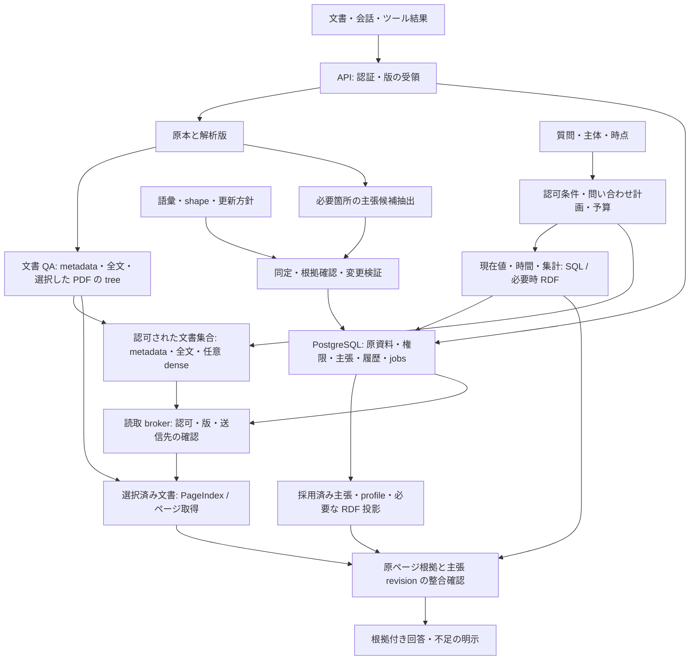
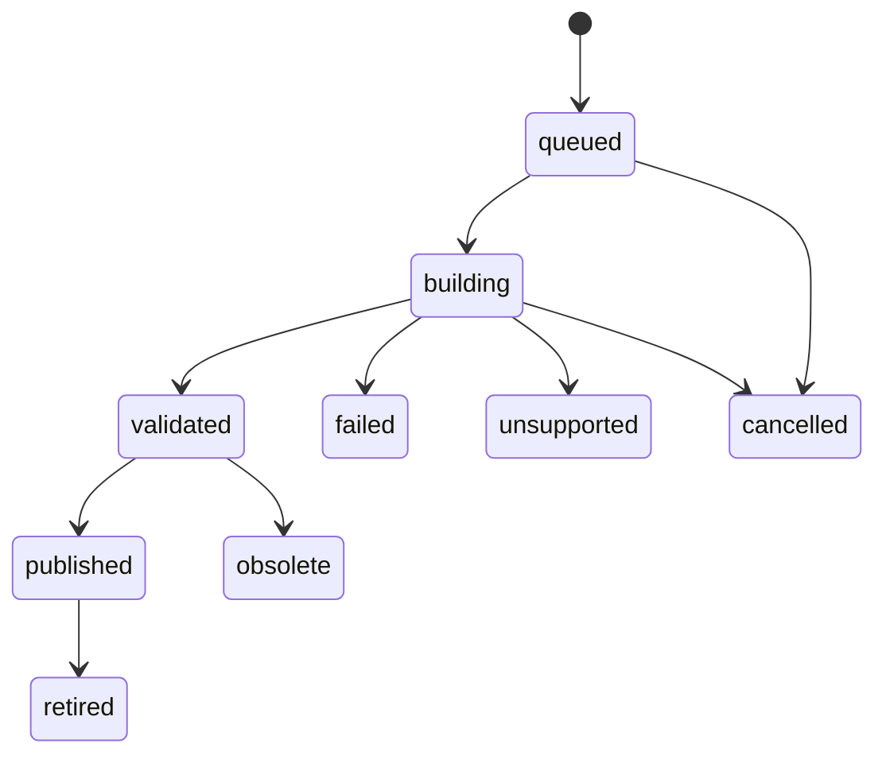

# オントロジー・ナレッジシステムの推奨設計

[ドキュメントガイド](../README.md) / [調査トップ](../research/README.md) / [資料台帳](../research/sources.md)

**作成日: 2026-09-28 / 改訂日: 2026-09-29 / 状態: PageIndex 調査を反映した実装提案。** 汎用の知識基盤、個人の長期記憶、専門分野のナレッジシステムを対象とする。利用者数、データ量、実行環境は未確定で、実装・性能測定はまだ行っていない。

推奨は、**PostgreSQL で原資料の版・権限・根拠・主張を管理し、「文書を読む経路」と「知識を採用・更新する経路」を分ける構成**である。文書集合からの候補選択は metadata・全文検索を基準にし、選んだ長文 PDF の内部探索に PageIndex を接続する。pgvector、RDF 検索、形式推論は必要な問いで比較して追加する。

PageIndex の木は文書の章・節・ページを探す索引である。オントロジーは概念と関係の意味、メモリーは観測・事実・嗜好・経験の保持と更新を担う。文書に回答できることと、その内容を確定した知識として採用することを別の状態として扱う。

本改訂は [PageIndex 調査](../research/systems/pageindex.md)の固定コミット `619cbd89f6dd02681a8cfc5d00b1f9b4848e973e`（SDK `0.2.10`）と一次資料を根拠にした設計判断である。提供者のベンチマーク値を、この構成の実測値や採用保証には用いない。[設計仮説](../research/design-directions.md)と[評価計画](../research/evaluation.md)も同じ役割分担に合わせる。

**目次**

- [設計方針と調査からの判断](#設計方針と調査からの判断)
- [知識を表すための概念](#知識を表すための概念)
- [推奨技術スタック](#推奨技術スタック)
- [システム構成と責務](#システム構成と責務)
- [三つの用途に適用する構成](#三つの用途に適用する構成)
- [オントロジーの作り方](#オントロジーの作り方)
- [正本のデータモデル](#正本のデータモデル)
- [取り込み・更新・検索の処理](#取り込み更新検索の処理)
- [訂正・撤回・削除の扱い](#訂正撤回削除の扱い)
- [APIと運用上の契約](#apiと運用上の契約)
- [別構成を選ぶ条件](#別構成を選ぶ条件)
- [実装順序と評価基準](#実装順序と評価基準)
- [関連ドキュメント](#関連ドキュメント)

## 設計方針と調査からの判断

**Decision — 文書 QA と知識更新を独立して進める** — proposed · 2026-09-29

原資料を版付きで保存し、解析・権限確認を終えた段階で文書 QA を提供する。全文から主張を抽出し終わることを検索開始の条件にしない。繰り返し使う事実、訂正が必要な状態、業務上の関係は、必要箇所から候補を抽出し、根拠・語彙・更新方針を検査して採用する。

**前案から変更する判断**

|         | 前案                   | 改訂案と理由                                                   |
| ------- | -------------------- | -------------------------------------------------------- |
| 初期検索    | 全文＋pgvector を標準構成に含む | metadata・全文を基準線にし、文書内 PageIndex と dense/hybrid を用途別に比較する |
| 取り込みの流れ | 解析から主張抽出・採用・索引作成へ進む  | 原資料から文書 QA と知識化を分岐し、抽出が未完了でも根拠付きで読める                     |
| 階層検索    | 後段で追加する要約・構造         | 長文 PDF は初期実験から PageIndex を評価する                           |
| 検索単位    | 原文・主張・要約を取得          | 文書の発見と文書内の根拠取得を分け、失敗箇所も別に計測する                            |
| 版管理     | 原資料の版と投影状態           | 解析の版、IndexBuild、provider の文書 ID、ページ対応を明示する               |
| 採用する正本  | PostgreSQL＋語彙 bundle | 維持する。tree の要約や関連度だけでは主張を採用しない                            |

PageIndex local は文書一覧・構造・ページを読む機構と chat を持つ。一方、文書 ID の指定だけで、アプリが必要とする tenant・時点・削除の契約を満たすとは限らない。とくに `document_context()` は agent への指示文であり、認可の実装ではない。[D-PI-AGENTS] [C-PI-TOOLS] [C-PI-CLIENT]

維持する原則は、語彙・制約・事実の採否を分けること、双時間で訂正履歴を残すこと、独立した根拠と派生の依存を追うこと、検索品質と更新の正しさを個別に測ることである。根拠は[オントロジーの標準](../research/foundations/ontology.md)、[知識更新](../research/foundations/knowledge-updates.md)、[メモリーの基礎](../research/foundations/memory.md)にまとめている。

## 知識を表すための概念

|           | この設計での意味                | 実装への反映                                 |
| --------- | ----------------------- | -------------------------------------- |
| 原資料と観測    | 誰が、いつ、どこで述べたかという記録      | SourceRevision と原文の範囲を保存する             |
| 実体とメンション  | 実世界の対象と、その対象への文章中の言及    | Entity と Mention を分離し、同姓同名や統合の取り消しを扱う  |
| 主張        | 対象・関係・値・条件を持つ、採否を検討する単位 | Assertion に否定、仮定、予定、視点を付ける             |
| オントロジー    | クラス・関係・意味・公理を共有する語彙体系   | 安定した IRI と型の階層を定義する。業務語彙を小さく始める        |
| 制約        | データが満たすべき構造と整合条件        | Pydantic、SHACL、DB 制約で段階的に検査する          |
| 更新ポリシー    | 新情報に対して何を残し、何を置換するか     | 関係ごとの単値・多値、時間、情報源の優先順位を定義する            |
| 双時間       | 世界で有効な期間と、記録上そう認識していた期間 | valid\_from/to と system\_from/to を分ける  |
| 来歴と真理維持   | 結論の根拠と、その変更による影響を追う考え方  | EvidenceSupport と Derivation を使って再評価する |
| 正本と検索用データ | 採用状態を決める記録と、検索を速くする派生物  | 索引・要約・グラフは正本から再構築できるようにする              |
| 不確実性      | 不明、未確認、対立、棄却を表す状態       | 一つの confidence 値だけで真偽や採用を決めない          |

OWL は開世界の意味論を採り、未記載から直ちに偽を導かない。必須フィールドの欠落は SHACL や DB 制約で検査し、事実の正しさは根拠と更新方針で判断する。`owl:sameAs` は強い同一性なので、名前や埋め込みが似た候補の表現には使わない。[S-OWL] [S-SHACL]

`extraction_confidence`、情報源への信頼、検索の関連度、行動に役立った度合いは別項目にする。たとえば「検索で高順位だった情報」が「信頼できる最新の事実」とは限らない。経験・手順の有用性を学習する場合も、主張の根拠評価と分ける。

## 推奨技術スタック

### 最小構成と比較候補

**共通基盤と追加する機能**

|            | 技術                                   | 導入時期と役割                             |
| ---------- | ------------------------------------ | ----------------------------------- |
| API とデータ契約 | Python・FastAPI・Pydantic              | 最初から。認証、入力、問い合わせ条件、変更計画を扱う          |
| 正本と履歴      | PostgreSQL・SQLAlchemy・Alembic        | 最初から。原資料の版、権限、根拠、ジョブ、主張の変更を記録する     |
| 原本と解析結果    | ファイルまたはオブジェクトストレージ                   | 最初から。hash を持つ原資料と解析版を独立して保存する       |
| 文書集合の基準検索  | metadata・SudachiPy＋PostgreSQL 全文検索   | 最初から。資料指定なら直接取得し、探索時は語彙検索を使う        |
| 文書内の構造検索   | PageIndex local adapter              | 長文 PDF の初期比較に追加。採用する文書種別は適格性と実測で決める |
| 意味検索       | pgvector・BGE-M3 dense など             | 任意。語彙不一致による取りこぼしが問題になった時に比較する       |
| 語彙と更新方針    | RDF/OWL・Turtle・Git の小さな bundle       | 契約は初期から定義し、主張を扱う段階で適用する             |
| 主張の検査      | RDFLib・pySHACL                       | 知識化を開始する段階。変更候補と影響範囲の型・shape を確認する  |
| 背景処理       | Python worker・PostgreSQL jobs/outbox | 原資料受領時から。索引と知識化を別 job とし、再試行可能にする   |
| モデル呼び出し    | 提供者ごとの adapter                       | 文書探索、抽出、回答、埋め込みを分離し、送信先と予算を管理する     |
| 実行環境       | uv lockfile・コンテナ・開発用 Compose         | 採用する Python・DB・依存・モデルの版を互換性確認後に固定する |

API と DB の候補は FastAPI / Pydantic / SQLAlchemy / Alembic、ジョブ取得と依存固定は PostgreSQL / uv の一次資料に基づく。[D-FASTAPI] [D-PYDANTIC] [D-SQLALCHEMY] [D-ALEMBIC] [D-PG-SELECT] [D-UV]

日本語の文書・質問に同じ辞書、正規化、分割モードを適用し、`to_tsvector('simple', ...)` を基準にする。PostgreSQL の `ts_rank` / `ts_rank_cd` を BM25 と呼ばない。BGE-M3 dense の 1024 次元は比較設定の一例で、pgvector を含め初期の必須依存にはしない。導入する際はモデル・revision・次元・正規化を固定し、異なる埋め込み空間を混在させない。[D-SUDACHI] [D-PG-FTS] [D-BGE] [D-PGV]

### PageIndex の使い方を限定する

最初の接続候補は、固定版の local SDK を worker 内の adapter から呼ぶ構成とする。PDF 原本は自システムに置き、PageIndex store は再構築できる投影にする。local SDK の投入は PDF が対象で、CLI の Markdown 経路、Cloud の OCR や追加形式、File System の文書集合管理とは分けて評価する。[C-PI-LOCAL] [C-PI-STORE] [C-PI-CLI] [D-PI-DOCS] [D-PI-FILESYSTEM]

Flash は構造検出の段階を LLM なしで行えるが、通常の SDK 処理には要約・最適化・回答の LLM 呼び出しがある。ローカル保存とオフライン推論は同義ではない。最小実験でも送信可能なモデルを先に固定し、送信不可の資料を外部 backend へ渡さない。[D-PI-FLASH-README] [C-PI-FLASH-API] [C-PI-LOCAL] [C-PI-CHAT]

### 要件に応じて追加するもの

**拡張を選ぶ条件**

|                   | 追加候補                    | 先に確認する条件                                             |
| ----------------- | ----------------------- | ---------------------------------------------------- |
| スキャン・表・座標         | Docling 等の parser / OCR | OCR 品質と原ページへの対応。PageIndex の PDF 解析と同一の offset と仮定しない |
| 専門語彙の編集           | Protégé・ROBOT           | 専門家のレビュー、廃止語、リリース運用が必要になる                            |
| 専門語彙への grounding  | OntoGPT / LinkML        | 抽出と識別子対応の品質が基準線より改善する                                |
| SPARQL / ルール      | Oxigraph、Jena / Fuseki  | SQL の問いでは不足する必要性と、対象 snapshot の意味を説明できる              |
| 再ランキング・階層要約       | 別 adapter               | 費用と根拠の失効処理を含め、回答が改善する                                |
| 外部 DB / job queue | 専用 vector DB・分散基盤       | 単一 PostgreSQL と worker の負荷が実測上の制約になる                 |

parser、語彙、RDF 基盤の比較根拠は各一次資料と[実装基盤の調査](../research/implementation/infrastructure.md)を参照する。[D-DOCLING] [D-PROTEGE] [D-ROBOT] [D-ONTOGPT] [D-OXI] [D-JENA] [D-JENARULE]

pySHACL の推論設定は `none`、`rdfs`、`owlrl` などから明示して固定する。まず推論なしの検証を基準にし、形式推論を追加する場合は実際の公理と reasoner の対応範囲を別に評価する。[D-RDFLIB] [D-PYSHACL] [D-JENARULE]

## システム構成と責務

API と worker を一つのコードベースで実装し、PostgreSQL と原資料ストレージを共有する。PageIndex は worker から呼ぶ交換可能な adapter として始め、独立サービス化は負荷や障害分離の必要性を測ってから判断する。



**責務の境界**

|                         | 担うこと                        | 渡すもの                                        |
| ----------------------- | --------------------------- | ------------------------------------------- |
| ingestion / parse       | 原資料の版と抽出位置、利用可能性を管理         | SourceRevision と ParseRevision              |
| document indexing       | 全文・任意の tree / vector を作成・検証 | revision に固定された IndexBuild                  |
| discovery               | 権限と時点を満たす文書候補を選択            | 許可された revision の限定リスト                       |
| evidence broker         | 各 tool 読取と各モデル送信の認可を強制      | 許可範囲内の構造・原ページ・EvidenceRef                   |
| extraction / resolution | 必要な主張候補と実体同定を作成             | 未採用の候補と原文の対応                                |
| knowledge / ontology    | 意味、制約、更新方針で採否を確定            | AssertionRevision・EvidenceSupport・ChangeSet |
| memory                  | 事実・嗜好・経験を目的に応じて保持           | 来歴と適用条件を持つ profile / 経験                     |
| query / evaluation      | SQL と文書探索を組み合わせ、費用と不足を記録    | 回答、根拠、探索範囲、計測結果                             |

正本は、**採用状態・版・権限を記録する PostgreSQL、原本を保存するストレージ、語彙・shape・更新ポリシーを版管理する bundle**に役割を分ける。tree、要約、vector、RDF の検索投影を直接編集可能な第二の知識正本にしない。稼働時には bundle の内容と hash を保存する。

原本の保存と SQL は一つの DB transaction にはならない。blob の保存・hash 検証後に参照と outbox を確定し、孤立した blob は後で回収する。PageIndex のファイル書き込みも同様に staging の build とし、SQL による公開許可が出る前は query から見せない。

PageIndex に複数 doc ID を渡す能力と、文書集合から漏れなく候補を発見する能力を区別する。Cloud File System の説明を OSS local の corpus discovery・ACL・増分更新の保証として扱わない。[C-PI-CLIENT] [D-PI-FILESYSTEM]

## 三つの用途に適用する構成

三つの用途で、原資料、証拠、版、同定、訂正、検索の契約を共有する。違いが大きいのは、記憶単位、語彙の厳密さ、読み出し方、正解を判断する基準である。

|         | 汎用の知識基盤                   | 個人の長期記憶・アシスタント              | 特定業務・専門分野                                     |
| ------- | ------------------------- | --------------------------- | --------------------------------------------- |
| 主な入力    | 文書、会話、ツール結果、外部システムの変更     | 対話、個人ノート、予定、作業結果            | 業務データ、専門文書、標準語彙、承認済み記録                        |
| 中心となる単位 | 原資料、主張、実体、出来事             | エピソード、人物像、嗜好、予定、経験・手順       | 型付き実体、関係、イベント、主張、公理                           |
| オントロジー  | 小さな共通語彙と追加可能なドメイン語彙       | 人物・時間・状況と、記憶の用途を示す軽い語彙      | 専門家が管理する語彙・公理・shape・外部識別子                     |
| 初期の保存基盤 | PostgreSQL を正本とする推奨構成     | 推奨構成を一利用者に縮小。必要ならノートを編集面にする | 業務更新が中心なら PostgreSQL、RDF の意味論・交換が中心なら RDF ストア |
| 主な読み出し  | SQL、文書選択とページ探索、必要に応じた意味検索 | 小さな常駐 profile と、必要時の記憶検索    | SQL / SPARQL、制約付き検索、必要な推論                     |
| 更新の中心   | 文書改訂、情報源の競合、根拠撤回          | 状態変化、訂正、嗜好の文脈、忘却、経験の再評価     | 業務イベント、承認、語彙移行、ルール変更                          |
| 評価の中心   | 根拠回収、回答、訂正、費用             | 個人化の適切さ、時間、撤回、行動への有用性       | competency questions、制約・含意の正しさ、監査可能性          |

### 汎用の知識基盤

PostgreSQL を正本にし、原文の検索と構造化主張の検索を併用する。文書 QA を先に利用可能にし、再利用・時間更新が必要な人・組織・関係・日時を選択的に主張へ抽出する。説明文、議論、曖昧な記述は出典付きの原文として検索可能にする。抽出に失敗した内容を消さず、「未構造化だが出典を持つ情報」として利用できるようにする。

取り込み元ごとに source ID、更新検出、削除通知、再取得の契約を決める。外部システムが正本である業務データは、複製した時点と参照先を保持する。鮮度が特に必要な問いでは元システムへの照会を選択できるようにし、取得結果も時刻付きの観測として扱う。

段階的に増えるドメイン語彙は名前空間で分け、同じ語でも分野によって意味が違う場合は別 IRI にする。LLM が作った新しい分類や関係は候補として評価し、既存の competency questions とデータへの影響を確認してから語彙へ取り込む。これにより、柔軟な取り込みと意味の安定性を両立させる。

### 個人の長期記憶・アシスタント

共通の Source / Assertion / Evidence を使いながら、読み出し先に応じて記憶を分ける。

|                | 保存・更新の方針               | アシスタントでの使い方                |
| -------------- | ---------------------- | -------------------------- |
| エピソード          | 会話や作業結果を日時・参加者・根拠付きで保存 | 以前の文脈や失敗の経緯を検索する           |
| 事実・嗜好          | 有効期間と状況を持つ主張として保持      | 必要な条件に合う情報だけを個人化に使う        |
| profile / 観察要約 | 採用済み主張から作る派生物として版管理    | 小さな token 予算の常駐文脈として使う     |
| 予定・意図          | 予定と実行結果を別に保持           | 期限を過ぎた予定を実現済みと推定しない        |
| 経験・手順          | 適用条件、結果、利用した環境・道具の版を持つ | 次の行動候補に使い、有用性と事実の確度を別に更新する |
| 作業状態           | セッション・タスクの進行状態として保持    | 長期の人物情報への自動昇格を避ける          |

明示的な自己申告、行動からの推定、別の観測者による判断を区別する。「いつも短い回答を好む」という推定を、本人が確認した普遍的な事実に置き換えない。人物像の更新も支持する観測と適用する文脈を残す。

初期は profile の常駐配置と全文検索を比較し、必要ならベクトル検索を加える。個人の情報量が増えた時に関係探索を加える。添付された長文 PDF には PageIndex を使えるが、会話や嗜好を無理に PDF の木へ変換しない。profile やノートを人が修正した場合は、それを新しい情報源・訂正要求として正本へ反映する。要約だけを直接書き換えて次の再生成で失う構成にしない。

エージェントとは HTTP API、必要なら MCP を介して接続する。読み出し、記憶の候補追加、明示的な訂正・消去を別の操作にし、すべて共通の knowledge モジュールを通す。会話外の行動に利用する手順には適用条件と権限を持たせる。比較対象は[Letta・Basic Memory・Mastra](../research/systems/agent-memory.md)と[Hindsight](../research/systems/structured-memory.md)で、回答 QA と行動タスクを別々に評価する。

### 特定業務・専門分野のナレッジグラフ

業務で答えるべき問いと、許される操作を先に確定し、専門家と語彙・関係・制約を定義する。既存の専門語彙を使う場合も、取り込むモジュール、版、外部識別子との対応を固定する。上位オントロジーは、分類や相互運用に必要な範囲を選び、分野に合う定義を優先する。

業務上の更新・履歴・権限が主な難しさなら、PostgreSQL の正本と RDF 投影を使う。SPARQL によるデータ連携や RDF 自体の編集・制約が業務の中心なら、RDF ストアへ正本の責務を移す。この場合も、主張・証拠・双時間・変更履歴の契約を RDF 上に定義する。SQL と RDF の両方を独立に編集可能な正本にはしない。

推論は、型階層、関係の包含、業務ルール、必要な OWL 公理という順に範囲を明示する。採用する ontology の profile に合う reasoner を選び、既知の含意・非含意・矛盾の例で確認する。ルールの結果にも入力 revision と rule version を対応付け、原資料や公理が変更された時に影響する結論を再評価する。

確定した業務知識へ反映する条件は、情報源の権威、制約検査、必要な担当者のレビューで定義する。抽出できなかった項目や未知の語彙は保留として可視化する。厳しい制約で誤りを減らすだけでなく、正しい新概念を取りこぼしていないかも測る。

三つの用途を一つのサービスで扱う場合も、テナント、視点、業務範囲、語彙の bundle を分ける。個人の推定や未確認のメモが、業務上の確定知識へ自動的に昇格する経路を作らず、共有する時には出典と採用条件を検証する。

## オントロジーの作り方

### 答えたい問いから語彙を決める

まず、システムが答えるべき問いを具体例と期待結果で定義する。これを competency questions として、オントロジーの変更時にも使う。

|                          | 必要な概念・関係                                  |
| ------------------------ | ----------------------------------------- |
| この人の現在の主な勤務先はどこか         | Person、Organization、主な勤務先、有効期間、観測者        |
| 4 月の勤務先を、5 月時点の認識で答えられるか | 有効時刻、記録時刻、主張の版                            |
| その回答はどの資料のどの部分に基づくか      | SourceRevision、SourceSpan、EvidenceSupport |
| 一つの記事が撤回されたら、どの結論を見直すか   | 主張の支持関係、Derivation                        |
| 同じ名前の二人を誤統合したら元に戻せるか     | Mention、実体同定の判断、統合・分割履歴                   |

コア語彙は、`Entity`、`Event`、`AssertionRevision`、`SourceRevision`、`EvidenceSupport`、`Derivation` を中心にする。`Person`、`Organization`、雇用や所属などの関係はドメイン用モジュールへ分ける。すべての対象を汎用的な `relatedTo` で結ばず、必要な問いに意味を持つ関係を定義する。

既存語彙は、来歴に PROV-O、用語のラベル・同義語・分類に SKOS、交換用の表現に JSON-LD を使う。PROV-O の Entity / Activity / Agent は、資料・抽出処理・作成者などの対応を表せる。一方、主張の採用状態や更新方針はアプリ独自の語彙として定義する。[S-PROV] [S-SKOS] [S-JSONLD]

### 語彙、制約、更新方針を一つのリリースとして管理する

次は実装時に作るファイル構成の例であり、このリポジトリに実装済みという意味ではない。

```text
ontology/
  core.ttl                    # 主張、原資料、根拠、派生
  domains/employment.ttl      # 人物、組織、雇用に関する意味
  shapes/assertion.ttl       # 保存可能な主張の構造
  policies/lifecycle.yaml    # 関係ごとの更新・併存ルール
  competency-questions.yaml  # 問いと期待する答え
  examples/                  # 正常例と違反例
  manifest.json              # 各ファイルの版・hash・依存する語彙
```

用語の IRI は安定させ、表示名の変更で識別子を変えない。意味を変更する場合は、廃止語・置換先・既存データへの移行を定義する。`ontology_version`、`shape_version`、`policy_version` は bundle で対応付ける。Pydantic の型と SHACL を手動で管理する段階では、同じ正常・異常例を両方に通してずれを検出する。形式が違うだけで同じ意味になるとは仮定しない。

更新ポリシーの例は次のようになる。`primaryEmployer` は、この用途で定義した「主な勤務先」であり、一般の所属関係 `worksFor` を単値に制限するものではない。

```yaml
predicate: https://example.org/grimoire/primaryEmployer
subject_type: Person
object_type: Organization
slot_key: [tenant_id, viewpoint_id, subject_id, predicate, employment_context]
cardinality: at_most_one_at_a_valid_time
world_change: close_previous_interval_and_add_assertion
correction: append_revisions_for_affected_assertions
conflicting_sources: keep_disputed_until_resolved
unknown_term: stage_as_candidate
```

これは本提案の設定形式であり、既存ライブラリへそのまま渡せる仕様ではない。多値を許す関係、複数の視点、予定と実現済みの事実には別の方針を設定する。

### SHACL と更新検査の境界

次は、直接抽出した主張の構造を検査する shape の抜粋である。`kg:` は例示用の独自語彙で、完全なオントロジーや全制約を定義したものではない。

```turtle
@prefix kg: <https://example.org/grimoire/> .
@prefix sh: <http://www.w3.org/ns/shacl#> .

kg:ExtractedAssertionShape a sh:NodeShape ;
  sh:targetClass kg:ExtractedAssertionRevision ;
  sh:property [
    sh:path kg:subject ;
    sh:minCount 1 ; sh:maxCount 1 ; sh:nodeKind sh:IRI
  ] ;
  sh:property [
    sh:path kg:predicate ;
    sh:minCount 1 ; sh:maxCount 1 ; sh:nodeKind sh:IRI
  ] ;
  sh:property [
    sh:path kg:object ;
    sh:minCount 1 ; sh:maxCount 1
  ] ;
  sh:property [
    sh:path kg:support ;
    sh:minCount 1 ; sh:class kg:EvidenceSupport
  ] .
```

SHACL は与えた RDF グラフを検証する。関係ごとの subject/object の型、許可語彙、時間の整合などは追加の shape・アプリ検査で補う。推論由来の主張には Derivation を要求する別の shape を用意する。支持レコードが存在する検査と、原文が実際に主張を支持する検査は別工程にする。[S-SHACL]

単値関係の重複や実体統合を検査する場合、候補一件だけでなく、影響する既存主張と型情報も検証対象に含める。検証中にその範囲の版が変わった場合は、保存時に競合として再検査する。未知語は候補領域に残し、抽出 LLM が本番の語彙や公理を直接変更する経路は設けない。

## 正本のデータモデル

**追跡するレコード**

|                                       | 主な情報                                                 | 保持する理由                              |
| ------------------------------------- | ---------------------------------------------------- | ----------------------------------- |
| Source / SourceRevision               | tenant・安定 ID・原本 URI・hash・発行/取得/記録時刻・権限参照             | 同じ資料の改訂、検索対象の選択、撤回・消去の起点            |
| ParseRevision / SourceSpan            | 原資料版・parser と設定の版・抽出結果 hash・ページ/座標/文字範囲              | 解析器が変わっても引用したテキストを特定する              |
| IndexBuild                            | 原資料版・解析版・方式・依存/モデル/prompt/設定 fingerprint・成果物 hash・状態 | 再索引、検証、費用、失敗を build ごとに追う           |
| ProviderDocument                      | tenant・IndexBuild・provider\_doc\_id・保存先              | PageIndex の文書 ID と自システムの安定 ID を分離する |
| IndexPublication                      | 対象 revision・検索方式・公開 build・generation・公開/終了時刻         | 完成済みの build を原子的に切り替える              |
| EvidenceRef                           | source/parse/build の ID・原ページ/範囲・引用 hash・取得経路         | 文書 QA の回答から原本へ戻る。主張の採用前にも使用できる      |
| Entity / Mention / ResolutionDecision | 安定 ID・型・名称・言及範囲・同定の根拠と版                              | 同姓同名と同定の取り消しを扱う                     |
| Assertion / AssertionRevision         | 主語・関係・値・条件・否定/様態・視点・双時間・状態                           | 世界の変化と認識の訂正を区別する                    |
| EvidenceSupport                       | 主張版・SourceSpan・支持/反証・出典系列                            | 複数の独立根拠と転載を区別する                     |
| Derivation                            | 入力 revision 集合・出力・rule/model/prompt の版               | 推論・profile・要約の再評価範囲を特定する            |
| OntologyBundle / ChangeSet            | 語彙/shape/policy hash・変更前後・理由・実行主体                    | 意味と採用判断を再現する                        |
| Job / OutboxEvent / ProjectionState   | 冪等性キー・lease・対象 revision/generation・適用した変更            | 中断・再送・検索反映の遅延を扱う                    |

`EvidenceRef` と後述の API は本提案の契約であり、PageIndex がそのまま返す schema ではない。`EvidenceRef` は正本の `SourceSpan` へ解決し、知識化ではその span と主張版を `EvidenceSupport` で結ぶ。探索に使った build が交換されても、原資料版・解析版に固定された支持関係は保持する。主語、関係、型付きの値、tenant、状態、時刻、外部キーは通常の列に置き、ドメインごとの qualifier は JSONB を併用する。実体参照と literal 値は排他的に持ち、tenant を含む参照整合性を DB で検査する。

### 原資料、解析、索引の識別子

```text
Source
  └─ SourceRevision（原本 hash を固定）
       ├─ ParseRevision（parser・抽出結果を固定）
       │    └─ SourceSpan / EvidenceRef（原ページと抽出テキスト）
       └─ IndexBuild（入力に使った ParseRevision 群を参照）
            ├─ ProviderDocument（PageIndex doc_id）
            └─ node locator（この build の中だけで解釈する）
```

local SDK の投入は新しい UUID の `doc_id` を作る。同名ファイルの再投入を、同じ原資料の差分更新とは扱わない。`(index_build_id, node_id)` は探索の locator であり、build をまたぐ主張 ID や恒久的な引用先にはしない。アプリの冪等性キーと入力 hash で重複投入を管理する。[C-PI-LOCAL] [C-PI-STORE]

PageIndex 内部の PyPDF2 によるページ本文、Flash の構造検出、別途 Docling で得た本文は同一の抽出結果ではない。実際に引用した parser の版と抽出テキストを固定する。異なる解析結果間の文字 offset は転用せず、対応を検証できない場合は原 PDF のページ範囲までにとどめ、精密な文字位置を捏造しない。[C-PI-LOCAL] [C-PI-FLASH-API] [D-DOCLING]

PDF のページ番号は **原 PDF の 1 始まりの物理ページ**を基準とし、印刷されたページラベルを別項目にする。API の `get_tree()` は内部 tree と同じ範囲情報をすべて返すわけではない。adapter は範囲を取得した根拠を明記し、実際に読んだページから引用範囲を確定する。隣の node の開始位置だけで終端を推測しない。[C-PI-LOCAL]

```json
{
  "evidence_id": "ev_example",
  "source_revision_id": "source_r2",
  "parse_revision_id": "parse_r2_pypdf2",
  "index_build_id": "build_r2_flash_1",
  "locator": {"kind": "pdf_page", "page_start": 12, "page_end": 13},
  "printed_page_label": "10–11",
  "quote_hash": "sha256:<実際に取得した引用のhash>",
  "retrieval_method": "pageindex",
  "node_locator": "0007"
}
```

これは形を示す例である。返却前に ID 間の参照整合性、ページ範囲、引用の存在をサーバーが検査する。PageIndex の summary は候補選択に使い、本文を読まずに独立した証拠として引用しない。

### 主張の双時間と、資料の時刻を分ける

`Assertion` は追跡用 ID、`AssertionRevision` はある認識時点での内容である。世界の変化では旧主張の有効期間を閉じ、新しい主張を関連付ける。日付訂正では影響する主張の新しい版を作り、旧版の `system_to` の終了と新しい版の追加を同じ transaction で行う。

主張には `candidate`、`accepted`、`disputed`、`retracted` を定義する。予定・仮定・引用は `modality`、明示的否定は `polarity` に保持し、不明と否定を同一視しない。根拠の支持状態、実体同定、ontology / policy の版も履歴に含める。

原資料の発行日、対象期間、取得時刻、システムへの記録時刻、索引作成時刻は別項目とする。`known_at` で利用可能だった原資料版を選び、主張の `valid_at` は主張の有効期間へ適用する。資料の発行日だけで、その中の全事実の有効期間を決めない。時点付きの文書 QA では関連する日付を本文でも確認し、不明ならそのまま示す。

過去資料を現在の索引で読み直す「当時の資料に基づく再構成」と、当時のモデル・索引・候補・認識状態まで固定する「当時の回答の再現」は別の query mode にする。どちらも現在の権限と削除方針に従う。

## 取り込み・更新・検索の処理

### 原資料から二つの経路へ進める

**文書を検索可能にする経路**

1. `受領と原本保存`

   認証した tenant と情報源を確定し、原本 hash、SourceRevision、job を記録する。再送には同じ結果を返す。原本に含まれる文章を操作指示として実行しない。
2. `解析と適格性の確認`

   原ページに対応する ParseRevision を作る。形式、テキスト抽出の可否、構造、送信ポリシーを判定する。原本保存済みと解析済みを分ける。
3. `基準索引と必要な tree の構築`

   metadata・全文索引を作り、選んだ PDF に PageIndex build を追加する。知識化 job の完了は待たない。tree の作成中も利用可能な方式を明示する。
4. `検証と公開`

   入力 hash、原ページとの対応、node 参照、現在の source generation を検査する。公開 pointer を SQL transaction で更新し、利用できる検索方式を通知する。

**必要な内容をメモリー・知識にする経路**

1. `候補抽出`

   業務で必要な項目、明示的な記憶依頼、再利用する根拠箇所を対象に、主張・時刻・否定・様態を抽出する。QA の回答そのものを根拠にせず、元の SourceSpan を固定する。
2. `実体照合と変更計画`

   固定 ID、別名、型、文脈で実体候補を照合する。同じ関係・scope・有効期間の既存主張は SQL で列挙し、ベクトル上位 k 件だけで矛盾判定しない。曖昧なら保留する。
3. `検証と採用`

   Pydantic、SHACL、更新方針、根拠、権限、期待 revision を確認する。主張・証拠・ChangeSet・outbox を短い transaction で確定し、競合時は再評価する。
4. `派生物の更新`

   採用済み主張の検索、profile、必要な RDF 投影を更新する。入力が変わった派生物は失効または再生成する。文書 QA の索引状態と別に完了を管理する。

自動抽出の対象を選ぶ policy とその版を記録する。選ばれなかった領域を「事実が存在しない」と解釈しない。初期は手動登録・明示的な抽出要求を基準にしてから自動化する。操作は `add_assertion`、`add_evidence`、`supersede`、`correct_validity`、`mark_disputed`、`retract_source`、`split_entity` などに限定する。

### 問いに合わせて経路を選ぶ

**問い合わせの分岐**

|                      | 主経路                                          | 結果の扱い                      |
| -------------------- | -------------------------------------------- | -------------------------- |
| 指定資料の説明・条項・背景        | その revision を認可して直接読み、長文なら PageIndex でページを探す | 原文の記載として回答する               |
| どの資料に記載があるか          | metadata・全文、必要なら dense で文書を選び、その内部を読む        | 文書選択の漏れとページ選択の漏れを区別する      |
| 現在の所属・嗜好・更新履歴        | 採用済み主張を SQL と双時間条件で取得                        | 採用状態と根拠、競合・不明を示す           |
| 専門語彙の関係・含意           | 対象 snapshot の SQL / RDF と選択したルール             | 導出に使った主張版・規則版を返す           |
| 全契約の件数・全社員の集計        | 構造化された完全な対象集合または明示的な全件走査                     | 文書上位 k 件の探索で網羅性を保証しない      |
| 文書の説明と現在の事実を組み合わせる問い | 文書 QA と主張検索の両方                               | 古い記載と現在の採用事実が異なる場合は分けて説明する |

**文書検索から回答まで**

1. `条件と予算の確定`

   認証主体、tenant、視点、時間、明示的な文書指定、文書選択数、tool 回数、読取ページ/文字量、モデル費用、回答 context の上限を決める。router の判断と実際の消費を記録する。
2. `文書候補の取得`

   正本の権限と版選択を満たす候補だけを返す。metadata や title も内容として認可する。複数検索器を使う場合は RRF 等を比較するが、文書・主張・要約の取得枠を分ける。
3. `公開 build の固定と文書内探索`

   許可された revision と公開 build を query manifest に固定する。PageIndex adapter に限定された文書集合を渡し、構造・ページを evidence broker 経由で読む。候補追加が必要なら同じ認可を通して範囲を拡張する。
4. `根拠の検証`

   実際に読んだ原ページから EvidenceRef を構成する。主張を併用する場合は採用状態・有効期間・支持関係も照合する。すべての外部モデル送信前と回答返却前に現行の権限・削除状態を確認する。
5. `回答または保留`

   回答と revision 固定の引用、探索範囲、利用した方式、未反映・未対応・予算超過を返す。見つからなかった理由が探索の不足なら、資料に存在しないと断言しない。知識化は別の変更要求として扱う。

### PageIndex adapter の境界

内蔵 local chat は `_local_doc_scope` から tool に文書の allowlist を渡す経路を持つ。一方、外部 agent 向け `document_context()` / `folder_context()` は指示文であり、標準 tool が別文書を読めないことを保証しない。cloud と local の経路も同一ではない。初期実装では自前の broker を唯一の読取入口にして、認可を外せる store / SDK / 汎用 filesystem tool を回答 agent へ公開しない。[C-PI-CLIENT] [C-PI-TOOLS] [D-PI-AGENTS]

adapter は `capabilities`、`build`、`structure`、`read_pages`、`retire` を提供する本システムの内部契約とする。SDK に同名メソッドがあるという意味ではない。`structure` は可能な経路で `node_summary=True`、`include_text=False` を使い、必要な本文だけ後で読む。node 数、深さ、返却量も制限する。階層探索が常に対数時間になるとは仮定しない。[C-PI-LOCAL] [C-PI-TOOLS]

**適格性と代替経路**

|                       | 処理                                                    | 利用者へ返す状態                                  |
| --------------------- | ----------------------------------------------------- | ----------------------------------------- |
| テキストと構造のある PDF        | Flash build を比較対象にする                                  | ready または build 失敗                        |
| Flash が有効な階層を作れない PDF | 全文/ページ検索を継続。standard は追加費用を許す policy の場合だけ別 build で試す | unsupported\_structure と代替方式              |
| スキャン PDF・本文抽出不能       | 許可された OCR / parser へ分岐し、その解析結果から全文等で読む                | OCR 待ち・解析失敗・利用可能な代替方式                     |
| Markdown・会話・ツール結果     | 原形式の本文・主張・エピソードを索引化する                                 | PageIndex local PDF 経路の対象外                |
| 索引の未反映・破損・予算超過        | 正本の直接取得、利用可能な索引、待機、回答保留を policy で選ぶ                   | pending\_index・partial・budget\_exceeded 等 |

固定版の local SDK は OCR を行わず、Flash で階層化できない 10 個超の flat node は拒否する。この判定は製品内部の条件であって、このシステムの適格性をページ数だけで決める根拠にはしない。standard への自動切替、Docling Markdown を PDF-only SDK にそのまま投入する動作も仮定しない。[C-PI-LOCAL] [C-PI-CLI] [D-PI-FLASH-README]

pgvector を追加する場合、近似索引後のフィルタで候補不足が起き得る。exact search と比較し、iterative scan・分割・探索量を測る。権限を満たすことと十分な recall を得ることを別に試験する。[D-PGV]

RDF の監査用表現と、ある権限・時点で採用可能な事実の投影を分ける。履歴や tenant をまたぐ triple を無条件に合成して推論せず、直接 triple にも元の AssertionRevision を対応付ける。

## 訂正・撤回・削除の扱い

### 世界の変化と、過去の認識の訂正

次の入力を例にする。対象は、ある視点・雇用区分における「主な勤務先」という単値の関係である。

- 2026-04-10: 「4 月 1 日に A 社から B 社へ転職した」と記録する。
- 2026-06-01: 「転職日は誤りで、5 月 1 日だった」と訂正する。

|           | 世界での有効期間       | この認識を保持した期間        |
| --------- | -------------- | ------------------ |
| A 社所属・旧版  | 開始不明〜4 月 1 日未満 | 4 月 10 日〜6 月 1 日未満 |
| B 社所属・旧版  | 4 月 1 日以降、終了未定 | 4 月 10 日〜6 月 1 日未満 |
| A 社所属・訂正版 | 開始不明〜5 月 1 日未満 | 6 月 1 日以降          |
| B 社所属・訂正版 | 5 月 1 日以降、終了未定 | 6 月 1 日以降          |

`valid_at=2026-04-15, known_at=2026-05-10` なら B 社、`valid_at=2026-04-15, known_at=2026-06-10` なら A 社を返す。この二つを区別することを最初の契約試験にする。

この表は日付単位の説明であり、記録時刻は実際の受領・確定時刻も保存する。期間は半開区間を基本とし、開始不明・終了未定・無期限を区別する。日付しかない情報に秒精度を与えず、精度、timezone、相対日付の基準を別に保持する。推定した期間は推定と分かる形で保存する。

### 根拠の撤回と派生物の再評価

`E1 → C1` と `E2 → C1` が独立した支持であれば、E1 の撤回後にも E2 に基づいて C1 を採用できる。`C1 ∧ C2 → C3` のような導出では、必要な入力が失効すると C3 も再評価する。転載や同じ会話の要約を、独立した証拠の追加として数えない。

初期は、撤回した原資料から依存関係を辿り、影響する主張・要約を `stale` にして再計算する方式を採る。代替の支持を確認する前に主張全体を削除しない。LLM が作る要約の Derivation は入力への依存を示す記録であり、完全な論理的証明として扱わない。

### 消去と保持

PageIndex の全 `provider_doc_id`、tree、ページ本文、要約も消去対象に含める。固定コードの local delete は元 PDF や外部モデルのログまで削除せず、ファイル削除の失敗をすべて API の失敗にする保証もない。アプリの削除台帳で先に利用を止め、各保存先の実在確認と再試行を行う。[C-PI-STORE]

有効期間の終了、採用の撤回、利用停止、物理削除を別の操作にする。消去対象には原文、主張中の値、索引、要約、キャッシュ、処理中ジョブを含める。監査記録にも削除対象の内容を複製して残さない。

再投入・バックアップ復元後の再構築でも、削除台帳を確認して対象を復活させない。バックアップからの物理消去が即時にできない運用では、保存期限と復元時の再削除手順を定義する。通常の履歴保存と、内容を消去する処理の境界を契約として明示する。

## APIと運用上の契約

### 最初に用意する API

以下は実装する責務の提案であり、PageIndex SDK の API 一覧でも実装済みの endpoint でもない。tenant と操作可能な範囲は認証情報からサーバーが確定する。

**共通 API の提案**

| method   | path                         | flags | description                                                                 |
| -------- | ---------------------------- | ----- | --------------------------------------------------------------------------- |
| `POST`   | `/sources`                   |       | 原資料と冪等性キーを受け、source\_revision\_id と、解析・索引・任意の知識化 job の ID を返す。              |
| `GET`    | `/sources/{id}/readiness`    |       | 原本保存、解析、利用可能な検索方式、知識化の状態を個別に返す。拒否・失敗・未着手を区別する。                              |
| `POST`   | `/sources/{id}/index-builds` |       | 対象 revision、検索方式、許可済み設定を検査して再索引を要求する。公開中 build を直接書き換えない。                   |
| `GET`    | `/jobs/{id}`                 |       | 状態、依存 job、失敗理由、再試行と対象 generation を返す。                                       |
| `POST`   | `/query`                     |       | 問い、任意の文書指定、valid\_at、known\_at、整合性条件、予算を受け、回答・EvidenceRef・主張版・探索範囲・不足理由を返す。 |
| `GET`    | `/evidence/{id}`             |       | 現在の権限と削除状態を確認して原ページ・抽出範囲を解決する。EvidenceRef 自体を認可証明にはしない。                     |
| `POST`   | `/changes`                   |       | 期待 revision、操作、根拠、理由を検査し、主張の採用・訂正・撤回を確定する。                                  |
| `GET`    | `/assertions/{id}/history`   |       | 許可された主張の版、支持・反証、変更理由を返す。                                                    |
| `POST`   | `/sources/{id}/retractions`  |       | 根拠の撤回と関連する派生物の再評価を開始する。                                                     |
| `DELETE` | `/sources/{id}`              |       | 利用停止を先に確定し、原本・全 build・cache・派生物の削除状態を保存先ごとに返す。                              |

`document_ready` と `knowledge_ready` は別の状態とする。一部の検索方式だけが利用可能な場合も、その状態を返す。`wait_for` は SourceRevision・IndexBuild または ChangeSet と必要な投影先を指定できるようにし、固定秒数の sleep を整合性の保証にしない。

問い合わせ結果には `query_id`、選択した原資料版と build、`answer_status`、探索済み/未探索の範囲、代替方式、未反映状態、使用予算を付ける。`partial` と完全な対象集合を照会した結果を区別する。過去に参照できた引用でも、権限失効・削除後は内容を返さない。

### 再索引、原資料の改訂、並行処理



これは本システムが持つ状態遷移である。失敗・未対応の理由を保存し、条件を変える再試行は別 build として追う。retry による provider の重複 doc ID は mapping を照合して回収する。外部書き込みと SQL は分散 transaction ではないため、成功後に worker が停止する場合も想定する。

**同じ SourceRevision の再索引**では、旧公開 build を使いながら新 build を staging に作る。原本 hash、実際に利用した解析版、ページ数・範囲、node の参照、成果物の存在・hash を検査後、`expected_generation` を用いて `IndexPublication` を原子的に更新する。遅く完了した旧 job が新しい公開状態を上書きしないようにする。

**新しい SourceRevision の受領**は別に扱う。原本保存後に source の最新 revision と generation を確定し、最新を要求する query は旧版を自動的に代用しない。新しい tree が未完成なら、その版の全文/直接取得、待機、`pending_index` を選ぶ。旧版を使えるのは、明示的な revision 指定または古さを明示して許可する query policy の場合に限る。

query 開始時に revision と build を manifest に固定し、途中で一部の node だけ新 build へ差し替えない。同一資料版の索引交換だけなら参照中の旧 build を保持できる。一方、資料の撤回・削除・権限失効は manifest 固定より優先する。最新性を厳格に求める query は返却前にも source generation を確認し、変わっていれば再実行または保留にする。

削除は tombstone と generation 更新を先に確定する。公開直前の transaction でも tombstone を検査し、実行中 job を含めて新たな公開を拒否する。非公開化とファイル消去を別状態で管理し、停止した job、孤立 build、バックアップ復元からの復活も検査する。

### 知識更新と job の整合性

LLM 呼び出し中は DB のロックを保持しない。主張の版の比較に加え、単値関係では `(tenant, viewpoint, subject, predicate, scope)` に対応する管理行を一意に作ってロックする。既存主張がゼロでも並行した二つの採用を防ぐ。

job 取得には `FOR UPDATE SKIP LOCKED` を使い、短い transaction で担当と lease を記録する。期限切れの再取得、試行回数、最終エラーを管理する。これは job の取得に使い、完全な知識集合を読む照会には使わない。[D-PG-SELECT]

outbox は正本の変更と同時に書き、`event_id` と投影先・対象 revision/generation で冪等に処理する。変更単位と投影先ごとに適用状態を記録し、最大処理済み ID だけで完了と判定しない。正本との再照合は古い候補を除外できるが、新しい情報の検索漏れは回復できないため、反映待ちと代替取得を併用する。

### 権限、派生データ、モデルへの送信

PostgreSQL の Row-Level Security を tenant 分離に使う。アプリ接続は table owner や `BYPASSRLS` を持つ role と分け、認証から決めた tenant 文脈を transaction 単位で設定する。DB の RLS は PageIndex store や外部モデルを保護しないため、broker 側でも確認する。[D-PG-RLS]

broker は tool ごとに、認証主体、tenant、許可された SourceRevision、query の文書集合、現在の削除/撤回状態、読取ページ範囲を検査する。モデルが引数として指定した tenant や文書 ID を信頼しない。文書一覧、title、metadata、tree summary、本文、cache のどれも同じ境界を通す。

文書内で権限が異なる場合、全ページから作った親 summary は非公開の内容を含み得る。初期は文書版単位の ACL に揃える。ページ単位の共有が必要なら、許可範囲だけの別投影を作り、元 PDF のページ対応を保持するまで tree 全体を公開しない。tenant ごとの store 分離は補助策であり、tenant 内の個別 ACL を省略する理由にはしない。

索引作成、要約、探索、再ランキング、回答の **各モデル呼び出しの前**に送信先・データ分類の組み合わせを検査する。local SDK でも送信が発生し得る。設定や実行経路で送信制御を強制できない adapter は、その分類の資料には使わない。完全なオフライン運用は対応 backend と依存処理を検証した時だけ選択肢にする。[C-PI-LOCAL] [C-PI-CHAT] [C-PI-UTILS]

読める根拠が独立して複数ある主張は、利用者が読める有効な根拠から回答できる。複数入力が揃って初めて成立する推論・要約は、初期は全入力への権限を要求し、足りなければ許可された入力だけから再生成する。profile と tree summary にも同じ考え方を適用する。

cache のキーには権限範囲と policy の版、時点、source/parse/build、モデル・prompt・bundle を含める。権限変更・撤回・削除を失効条件にし、cache hit 時も認可を確認する。検索・引用の tool は読み取りだけにし、資料中の指示や回答 agent の判断で記憶を採用・削除する権限を与えない。

既に許可して外部送信した内容を、後の権限失効で回収できるとは仮定しない。失効後の新たな送信・返却を止め、進行中 query の再確認点と取り消し動作を試験する。外部提供者での保持・消去はローカルの削除完了と分けて記録する。

### 観測と再現性

`source_revision_id`、`parse_revision_id`、`index_build_id`、`change_set_id`、`query_id` を関連付ける。文書選択の候補数、探索文書数、tool 呼び出し、読取ページ、LLM 入出力 tokens、再試行、代替経路、索引・更新・回答費用、p50/p95、検索可能になるまでの遅延を計測する。原文をログへ無制限に複製せず、必要な内容は権限付きの原本参照にする。

Python と lockfile、DB/拡張、parser/tokenizer/辞書、PageIndex の commit、モデル・prompt・設定、ontology bundle、データセットを固定する。SQL schema と語彙の migration は別に記録し、変更がどの解析・主張・投影の再構築を必要とするかを判断する。

## 別構成を選ぶ条件

長文 PDF への質問が中心なら、文書 QA と PageIndex の比較から始め、主張の自動抽出と RDF 推論を後段に置く。頻繁な値の更新・網羅的な集計が中心なら、先に構造化正本を整える。PageIndex はどちらにも接続できる検索投影であり、正本を選ぶ A〜D 案とは別の選択軸である。

|                                   | 推奨の変更                                       | 判断の要点                                     |
| --------------------------------- | ------------------------------------------- | ----------------------------------------- |
| RDF データの交換と SPARQL が主要な業務インターフェース | RDF ストアを中心とし、SQL はジョブ・運用情報を担う               | 正本を二重に持たず、訂正・来歴・時間・権限も RDF 側のデータ契約で設計する   |
| トランザクション確定時に RDF 全体の shape を検査したい | RDF4J の SHACL 機構を比較する                       | 対応する制約と再検証の範囲・費用を確認する。                    |
| 大きな分類体系と形式的推論が中心                  | 必要な OWL profile と reasoner を先に決める           | ELK 等の対象範囲と、実際に使う公理を対応させる。                |
| 時間付き関係の取り込みを早く検証したい               | Graphiti を比較用バックエンドとして試す                    | 独自の訂正・来歴契約を満たす部分を確認する。構造化メモリーの調査          |
| オントロジーに合わせた取り込みを早く検証したい           | Cognee / OntoGPT の抽出経路を比較する                 | 抽出 recall、未知語の扱い、保存前の検査を評価する。オントロジーの調査    |
| 抽象化した観察や人物像を重視する                  | Hindsight の retain / recall / reflect を比較する | 下位の根拠への対応と、訂正後の再生成を試験する。構造化メモリーの調査        |
| 人がノートを直接編集する小さな個人用システム            | Markdown を原資料・編集面にし、派生索引を構築する               | ファイル編集を検出して資料の新しい版として取り込む。エージェント・ファイル型の調査 |

対応する資料・解説: [構造化メモリーの調査](../research/systems/structured-memory.md)、[オントロジーの調査](../research/foundations/ontology.md)、[エージェント・ファイル型の調査](../research/systems/agent-memory.md)、[D-RDF4J]、[S-PROFILES]、[D-ELK]。

主要な違いはグラフ DB の有無だけではない。誰が正本を書き、どの単位の変更を確定し、どの根拠まで遡れるかが構成を決める。新しい基盤を採用する時も、既存と同じ訂正・削除・再構築の試験を通して比較する。

## 実装順序と評価基準

### 最初に作るもの

- [ ] **原資料と根拠の契約。** 代表的な日本語 PDF・会話・業務記録を用意し、source/parse/build、原ページ引用、ACL、削除の正常・異常例を定義する。ontology は共通語彙と必要な一領域から始める。 — P0
- [ ] **文書 QA の最小経路。** PostgreSQL、原本保存、解析、metadata・全文、読取 broker、引用付き回答を実装する。指定資料は直接取得できるようにし、主張の一括抽出は開始条件にしない。 — P0
- [ ] **PageIndex の早期比較。** 同じ資料群に Flash adapter を接続し、既知文書内と文書集合からの質問を別に測る。索引拒否・OCR・standard・代替方式の結果も記録し、同じ回答器と予算で基準線と比較する。 — P0
- [ ] **必要な知識の更新。** 手動で正解化した主張・証拠に双時間、撤回、競合、SHACL を適用する。その契約が通ってから選択的な抽出と実体照合を自動化する。 — P1
- [ ] **検索とメモリーの拡張。** 文書発見の漏れには dense/hybrid、関係や意味の問いには RDF、個人化には profile を個別に比較する。各要素を外した比較で効果と費用を確認する。 — P1
- [ ] **運用を含む採否の確定。** 並行再索引、資料改訂、権限失効、削除、復元、モデル交換を試し、全体の費用・遅延・品質を用途別に評価する。 — P1

優先度 p0 は限定評価を早く始めるための表示であり、PageIndex の本番採用・必須依存化を決定したものではない。段階 3 の性能測定に先立ち、公開する読取経路の権限・版・削除契約を試す。運用試験を最後まで延期するという意味ではなく、最終段階で負荷と障害条件を広げる。

### 採用を判断する試験

**共通の必須ゲートと性能評価**

|          | 測ること                                    | 合格の考え方                           |
| -------- | --------------------------------------- | -------------------------------- |
| 版付き引用    | 同名資料の再投入、parser 差、ページラベルと物理ページ、tree 再構築 | 引用が正しい原資料版と実際に読んだページへ解決する        |
| 索引切替     | 新旧 job の完了順逆転、重複配送、公開直前の停止              | 古い build の再公開や source 間の取り違えがない  |
| 改訂と未反映   | 新資料受領直後の最新 query、過去版の明示照会               | 最新に旧版を黙って混ぜず、未反映・不足を返す           |
| ACL と消去  | 一覧・title・summary・本文・cache・進行中探索・再構築     | 非公開資料を取得・新規送信・返却せず、削除済み内容を復活させない |
| 時間と更新    | 転職日の遡及訂正、複数所属、仮定/引用/予定/否定               | 世界の変化と認識の訂正を区別し、scope 内の契約を守る    |
| 根拠と同定    | 二つの支持の片方を撤回、同姓同名の分割                     | 正しい独立根拠を残し、影響する派生だけを再評価する        |
| 文書選択     | 関連文書 recall、必要な根拠集合、候補枠からの漏れ            | 文書内探索が良くても集合選択の失敗を隠さない           |
| 文書内探索と回答 | 原ページ回収、引用の支持、正答/保留、表・図・複数ページ            | 対象を層別し、処理拒否も含む全体の結果で判断する         |
| 費用と待ち時間  | 索引、モデル探索、再索引、再試行、削除、p50/p95             | 回答時費用だけで優劣を決めず、想定 query 回数も示す    |

決定的な権限・版・削除・更新の試験は、定義したケースの全件合格を採用条件とする。有限の試験の合格を全入力に対する保証とは扱わない。自然言語の正答率、根拠回収、保留率、費用・遅延の許容値は、用途とデータ量を決めて **実験前に**固定する。本書に実測済みの合格値はない。

PageIndex は、長文 PDF の対象層で基準線に対する品質・費用・遅延の利点があり、上記の共通契約を満たす場合に採用する。改善がない資料種別や拒否が多い入力には全文/直接取得等を残す。既知文書内の成功率だけが高く、文書発見や全体費用が条件を満たさない場合は採用範囲を広げない。

共通の抽出テキストと回答器を使う方式比較と、各製品固有の parser・設定を含む end-to-end 比較を分ける。PageIndex の native parser を外す比較を、SDK 全体の性能として報告しない。提供者の FinanceBench や OSS benchmark は条件と対象が異なるため、その数値を受け入れ基準へ転用しない。[D-PI-OSS-BENCH] [D-PI-FINANCE]

文書 QA、個人の記憶、専門分野の推論は別の結果表を持つ。個人の時間・嗜好には LongMemEval と独自の撤回例、行動には MemoryArena、専門分野には competency questions と含意・非含意の例を使う。詳細な母集団、再現条件、費用の数え方は[評価計画](../research/evaluation.md)にまとめる。

直近の実装着手点は、**SourceRevision / ParseRevision / IndexBuild / EvidenceRef の契約、認可付きページ取得、metadata・全文の基準線、PageIndex adapter と比較用の文書 QA セット**である。これに、手動で正解化した小さな主張更新セットを並行して用意する。

## 関連ドキュメント

- [PageIndex の仕組み・実装・評価と制約](../research/systems/pageindex.md)
- [設計の選択肢と検証仮説](../research/design-directions.md)
- [オントロジーと知識表現](../research/foundations/ontology.md)
- [与えられた情報による知識更新](../research/foundations/knowledge-updates.md)
- [実装基盤の選択肢](../research/implementation/infrastructure.md)
- [評価と再現実験の設計](../research/evaluation.md)
- [資料台帳](../research/sources.md)

[C-PI-CHAT]: https://github.com/VectifyAI/PageIndex/blob/619cbd89f6dd02681a8cfc5d00b1f9b4848e973e/pageindex/local_chat.py

[C-PI-CLI]: https://github.com/VectifyAI/PageIndex/blob/619cbd89f6dd02681a8cfc5d00b1f9b4848e973e/run_pageindex.py

[C-PI-CLIENT]: https://github.com/VectifyAI/PageIndex/blob/619cbd89f6dd02681a8cfc5d00b1f9b4848e973e/pageindex/client.py

[C-PI-FLASH-API]: https://github.com/VectifyAI/PageIndex/blob/619cbd89f6dd02681a8cfc5d00b1f9b4848e973e/pageindex/flash/api.py

[C-PI-LOCAL]: https://github.com/VectifyAI/PageIndex/blob/619cbd89f6dd02681a8cfc5d00b1f9b4848e973e/pageindex/local_api.py

[C-PI-STORE]: https://github.com/VectifyAI/PageIndex/blob/619cbd89f6dd02681a8cfc5d00b1f9b4848e973e/pageindex/local_store.py

[C-PI-TOOLS]: https://github.com/VectifyAI/PageIndex/blob/619cbd89f6dd02681a8cfc5d00b1f9b4848e973e/pageindex/agent_tools.py

[C-PI-UTILS]: https://github.com/VectifyAI/PageIndex/blob/619cbd89f6dd02681a8cfc5d00b1f9b4848e973e/pageindex/utils.py

[D-ALEMBIC]: https://alembic.sqlalchemy.org/en/latest/tutorial.html

[D-BGE]: https://huggingface.co/BAAI/bge-m3/blob/main/README.md

[D-DOCLING]: https://github.com/docling-project/docling/blob/main/docs/index.md

[D-ELK]: https://github.com/liveontologies/elk-reasoner

[D-FASTAPI]: https://fastapi.tiangolo.com/features/

[D-JENA]: https://jena.apache.org/

[D-JENARULE]: https://jena.apache.org/documentation/inference/

[D-ONTOGPT]: https://github.com/monarch-initiative/ontogpt/blob/main/docs/custom.md

[D-OXI]: https://github.com/oxigraph/oxigraph

[D-PG-FTS]: https://www.postgresql.org/docs/18/textsearch-controls.html

[D-PG-RLS]: https://www.postgresql.org/docs/18/ddl-rowsecurity.html

[D-PG-SELECT]: https://www.postgresql.org/docs/18/sql-select.html

[D-PGV]: https://github.com/pgvector/pgvector

[D-PI-AGENTS]: https://docs.pageindex.ai/sdk/agents

[D-PI-DOCS]: https://docs.pageindex.ai/sdk/documents

[D-PI-FILESYSTEM]: https://pageindex.ai/blog/pageindex-filesystem

[D-PI-FINANCE]: https://github.com/VectifyAI/Mafin2.5-FinanceBench/blob/1c890d5e0fd9929953d38282614555847727011d/README.md

[D-PI-FLASH-README]: https://github.com/VectifyAI/PageIndex/blob/619cbd89f6dd02681a8cfc5d00b1f9b4848e973e/pageindex/flash/README.md

[D-PI-OSS-BENCH]: https://github.com/VectifyAI/PageIndex-OSS-Benchmark/blob/ad4c0b92970a6f4801f09ff2e647389e8f5874fa/README.md

[D-PROTEGE]: https://protege.stanford.edu/software/

[D-PYDANTIC]: https://pydantic.dev/docs/validation/latest/concepts/models/

[D-PYSHACL]: https://github.com/RDFLib/pySHACL

[D-RDF4J]: https://rdf4j.org/documentation/programming/shacl/

[D-RDFLIB]: https://rdflib.readthedocs.io/en/stable/

[D-ROBOT]: https://github.com/ontodev/robot

[D-SQLALCHEMY]: https://docs.sqlalchemy.org/en/20/orm/session_transaction.html

[D-SUDACHI]: https://github.com/WorksApplications/sudachi.rs

[D-UV]: https://docs.astral.sh/uv/concepts/projects/sync/

[S-JSONLD]: https://www.w3.org/TR/json-ld11/

[S-OWL]: https://www.w3.org/TR/owl2-primer/

[S-PROFILES]: https://www.w3.org/TR/owl2-profiles/

[S-PROV]: https://www.w3.org/TR/prov-o/

[S-SHACL]: https://www.w3.org/TR/shacl/

[S-SKOS]: https://www.w3.org/TR/skos-reference/
