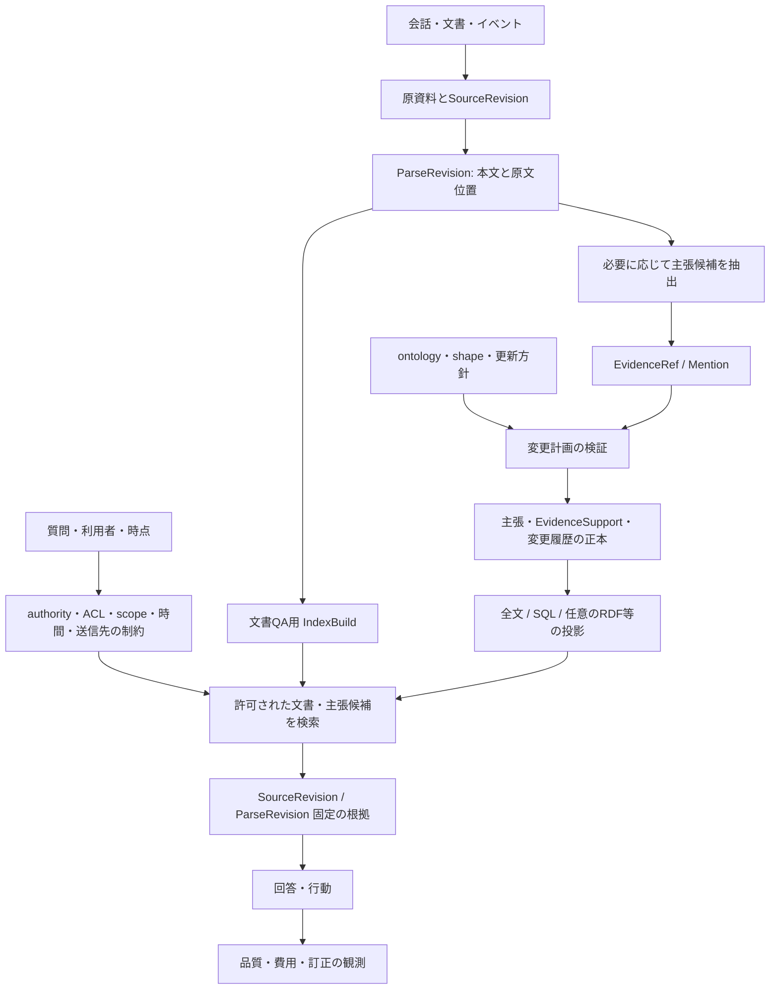

# 次世代システムの選択肢と検証仮説

[調査トップ](README.md) / [資料台帳](sources.md)

この文書は本調査の提案であり、既存研究によって性能が保証された構成ではない。先行技術の組み合わせを、そのまま新規性の主張にはしない。実装前に比較基準と反証条件を用意する。

これらの選択肢を具体的な技術スタック・データモデル・処理手順に落とした案は、[オントロジー・ナレッジシステムの推奨設計](../design/ontology-knowledge-system.md)にまとめた。汎用基盤、個人の長期記憶、専門分野への適用もそちらで扱う。

## 正本・知識モデルとしての四つの選択肢

A〜D は「知識をどこに正本として置き、どの更新・意味モデルを採るか」の選択肢である。検索器はこの選択と直交するため、たとえば A の正本に PageIndex を検索投影として加えたり、C の RDF 正本に全文検索を併設したりできる。

**A〜D: 正本・知識モデルの選択肢**

|                                          | 適する要件                 | 主な利点                                                                                  | 先に測るリスク                     |
| ---------------------------------------- | --------------------- | ------------------------------------------------------------------------------------- | --------------------------- |
| A. PostgreSQL の主張・証拠・revision            | 訂正、監査、tenant 分離を確実にする | transaction と正本を一本化しやすい。文書全文を使う場合は metadata / FTS を基準線にし、dense / hybrid は改善が測れた時に追加する | 多段 graph query と形式推論は別実装になる |
| B. Graphiti を中心に episode と temporal edge | 会話中の人・物・関係の変化を探索する    | 既存の同定・照合・時間更新を利用できる                                                                   | 抽出誤り、候補から漏れた矛盾、全版再現の保証      |
| C. RDF store＋小さな ontology＋SHACL          | 外部語彙と相互運用し、厳密な型・公理を使う | 識別子、標準 query、検証を共有できる                                                                 | モデリングと migration、時制・撤回処理の補完 |
| D. Markdown / 観察ログ＋全文検索                  | 人の編集、可搬性、少ない構成を重視する   | 理解・修正・バックアップが容易                                                                       | 細かい主張の訂正と出典の依存管理            |

それぞれの比較対象には pgvector、Graphiti、Cognee/OntoGPT、Letta/Basic Memory/Mastra がある。A が十分な性能を出すなら graph を追加する理由を個別に示す。C が必要な領域なら語彙制約を後付けする費用も比較に入れる。[D-PGV] [C-GUPDATE] [C-COGONTO] [D-ONTOGPT] [C-LMEM] [D-MASTRA]

## 文書検索方式は独立した選択軸

原資料から回答するか、原資料から型付き主張を作るかは利用目的で決める。検索方式は、文書集合から対象資料を選ぶ段階と、その資料のどの箇所を読むかという段階に分けて比較する。

**文書・知識検索方式**

|                | 役割                    | 採用の判断                                          |
| -------------- | --------------------- | ---------------------------------------------- |
| metadata / FTS | 文書集合の発見、語句・識別子による候補取得 | 最初の基準線。更新時刻、出典名、見出し、本文検索を同条件で評価する              |
| PageIndex      | 章立てのある長い文書内の節・ページ選択   | 文書内 tree から根拠箇所を探す投影として早期比較する。文書間の認可済み候補選択は別工程 |
| dense / hybrid | 表現の異なる自然言語質問から本文候補を拾う | 必須依存にせず、FTS 基準線に対する recall・精度の改善がある時だけ追加する     |
| SQL / RDF      | 型付き主張・関係・条件を問い合わせる    | 文書の本文検索とは分け、構造化知識への直接問い合わせに使う                  |

上の二つの表は方式ごとの優劣ではなく、組み合わせ可能な責務分担の案である。PageIndex は PDF の節構造やページ範囲を使う文書内検索で、local SDK の文書 ID 指定を ACL 付きの文書間発見と同一視しない。詳細は[PageIndex 調査](systems/pageindex.md)と台帳の [C-PI-LOCAL]、[C-PI-CLIENT] を参照。埋め込み方式の候補は pgvector などを使って、同一の資料集合・回答器・token 予算で測る。[D-PGV]

## 検証用の最小データ契約

**原資料・解析・知識の契約**

|                                 | 必要な情報                                                                                    | 分離する理由                                       |
| ------------------------------- | ---------------------------------------------------------------------------------------- | -------------------------------------------- |
| Source / SourceRevision         | 原本参照、hash、取得・発行時刻、作成主体、authority の根拠、利用権限                                                | 原本の版、再抽出、削除の起点。authority は判断材料であり真実の証明ではない   |
| ParseRevision                   | SourceRevision、parser・設定の版、正規化テキストと原文位置の対応                                               | 解析変更を原本や過去の引用と混同しない                          |
| EvidenceRef                     | SourceRevision / ParseRevision / IndexBuild、原ページ範囲、引用 hash、取得経路                          | 文書 QA 用の参照を canonical SourceSpan へ解決し、原本まで辿る |
| Mention                         | EvidenceRef、候補 entity ID、同定の状態                                                           | 誤った実体統合を取り消す                                 |
| Assertion / Revision            | subject、predicate、object、polarity、modality、scope、二つの時間                                   | 状態変化・訂正・仮定を区別                                |
| EvidenceSupport                 | AssertionRevision と canonical SourceSpan の対応、支持・反証の種別、出典系列                               | 一主張に複数の独立根拠を持たせ、転記を独立証拠と数えない                 |
| Derivation                      | 入力 claim revision、rule/model/prompt の版、出力                                                | 根拠の撤回を派生物へ伝える                                |
| OntologyVersion / PolicyVersion | 語彙、公理、shape、関係ごとの更新方針                                                                    | schema と更新方針の変化を監査                           |
| IndexBuild / Projection         | SourceRevision / ParseRevision、backend・モデル・prompt・設定版、PageIndex doc ID、build 状態、適用 event | 再構築の範囲を特定し、検証済みの索引だけを検索対象にする                 |

source と assertion を 1 対 1 の列だけで結ぶと、別資料の支持や転載の由来を表しにくい。EvidenceRef は query 用に source / parse / build と取得経路を持ち、canonical SourceSpan を解決する参照である。EvidenceSupport は主張と canonical SourceSpan の意味上の支持関係を表す。この分離は provenance と TMS の考え方を実装へ取り込む仮説である。[T-PROVENANCE] [T-TMS]

## 候補アーキテクチャ

各箱を独立したサービスにする必要はない。最初は単一プロセスと一つの正本で実装し、索引が必要になった所だけ投影を分ける。原資料 revision と parse を確定してから文書 QA と必要部分の主張抽出に分岐させる。QA の回答だけを要する入力をすべて主張化する必要はない。個別 DB の性能より、意味的な契約を先に試験する。

### 権限、出典の authority、LLM 送信

検索前に利用者・tenant・source policy から許可された SourceRevision を選び、PageIndex にはその集合の document ID だけを渡す。`document_context()` は LLM に対象文書を説明する prompt 文であって認可ではない。固定コードでは内蔵 local chat に構造的な document allowlist を渡す経路がある一方、cloud の回答経路では対象指定が prompt 側に残る。自作 agent tool にも個別の認可が必要である。[D-PI-AGENTS] [C-PI-CLIENT] [C-PI-TOOLS]

「ローカルに索引を保存すること」と「LLM 推論を端末内で行うこと」は別の性質である。固定 local store は metadata、tree、ページ抽出内容を保存し、indexing / summary / answer は設定した backend を呼び得る。source の authority、ACL、データ分類から送信可否を決め、許可された provider・model に限って本文を渡す。モデル送信を許可できない資料は、該当する外部呼び出しを止めるか、承認済みのローカル推論経路へ送る。[C-PI-LOCAL] [C-PI-UTILS] [C-PI-CHAT]

## 優先して反証する仮説

**比較する仮説**

|                                 | 変える要素                                              | 比較相手                                 | 測定する結果・反証                                              |
| ------------------------------- | -------------------------------------------------- | ------------------------------------ | ------------------------------------------------------ |
| H1: ライフサイクルの明示が stale fact を減らす | 有効期間、slot、retraction mask                          | 素朴な追加蓄積、同じメタデータを持つ未分類方式              | 正答、stale rate、棄却率。型を足しても改善しなければ型の効果とは言わない              |
| H2: 根拠依存の追跡が訂正を局所化する            | EvidenceSupport と Derivation                       | 全再構築、単純上書き                           | 撤回後に残る誤結論、正しい結論の誤削除、再計算費用                              |
| H3: ontology 制約は新規概念との両立が必要     | strict / soft / schema-free extraction             | 同じ抽出モデル                              | 型違反、抽出 recall、未知概念の保留品質、migration 費用                   |
| H4: 事実の信頼性と経験の効用を分けると負の転移が減る    | truth/evidence と utility を別値で保存                    | 一つの importance score                 | 正しいが役に立たない情報と、有用だが未検証の手順を区別できるか                        |
| H5: 階層化は小さい文脈での回答を改善する          | episode→claim→summary の選択                          | 全文検索、profile、観察ログ                    | 固定 token 予算下の回答品質、細部の消失、索引構築費用                         |
| H6: 文書構造の探索は長文書 QA の根拠回収を改善する   | metadata / FTS に PageIndex の文書内 tree traversal を追加 | 同一文書集合・回答器での FTS、必要なら dense / hybrid | 根拠ページ recall、誤った節選択、引用精度、索引費用と送信データ。章立て文書と非構造 PDF を分ける |

H1 は Fortunate Recall の型あり／なしの比較、H2 は TMS/provenance、H3 は LLMs4OL と Cognee、H4 は MemRL、H5 は RAPTOR / Hindsight / Mastra の発想に対応する。H6 は PageIndex を使う設計仮説であり、先行研究による優位性を主張しない。長文書 QA 用の候補として metadata / FTS と同じ評価セットで早い段階から比較する。PageIndex local の tree・ページ取得と外部 LLM 呼出の実装境界は[固定コードと確認範囲](systems/pageindex.md)に記録した。[P-FR] [T-TMS] [P-LLMOL] [C-COGSTRICT] [P-MEMRL] [P-RAPTOR] [D-HIND] [D-MASTRA] [C-PI-LOCAL] [C-PI-UTILS]

## 実験の順序

- [ ] **データ契約。** 少量の日本語例で、SourceRevision、ParseRevision、ページ引用、authority、ACL、外部送信可否、変化・訂正・否定・削除を正解化する。何を答えないべきかも記録する。
- [ ] **文書 QA の基準線。** metadata と PostgreSQL FTS で対象文書と正解根拠を検索する。章立てのある長文 PDF では PageIndex をこの段階で比較し、同じ資料、権限条件、回答器、token 予算を使う。
- [ ] **追加検索器。** dense / hybrid を任意の ablation として加え、FTS と PageIndex のどこで recall または精度が上がるかを別々に測る。pgvector の導入自体を受入条件にしない。
- [ ] **必要な主張抽出と更新。** 同じ SourceRevision / ParseRevision から主張候補を必要な範囲で作り、EvidenceRef を介して訂正・撤回・時間を順に検査する。最終状態だけを比較しない。
- [ ] **知識モデルの比較。** 同一の問いと更新履歴に Graphiti / Hindsight / RDF 制約付きの構成を加え、型・時間・来歴の寄与を ablation で分ける。SQL/RDF は構造化主張への検索として文書本文 retrieval と分離する。
- [ ] **外部評価。** LongMemEval、HaluMem、MemoryArena を組み合わせ、独自例に適合し過ぎていないかを見る。
- [ ] **運用。** 削除・再索引・モデル交換・並行入力の後でも同じ契約が守られるかを確認する。外部 LLM の使用有無、provider、model、送信量、p50/p95 と費用も記録する。

性能目標は用途とデータ量を決めた後に固定する。初期段階では、回答が良くなった根拠を paired な比較と信頼区間で示し、費用増と誤削除も同時に報告する。ベンチマークで優れた名前を選ぶより、今回の入力・更新・問い合わせの一連の挙動を説明できることを採用基準にする。

## 関連ドキュメント

- [知識更新の理論と実装](foundations/knowledge-updates.md)
- [評価と再現実験の設計](evaluation.md)
- [実装基盤の選択肢](implementation/infrastructure.md)

[D-PGV]: https://github.com/pgvector/pgvector

[D-PI-AGENTS]: https://docs.pageindex.ai/sdk/agents

[C-PI-CLIENT]: https://github.com/VectifyAI/PageIndex/blob/619cbd89f6dd02681a8cfc5d00b1f9b4848e973e/pageindex/client.py

[C-PI-LOCAL]: https://github.com/VectifyAI/PageIndex/blob/619cbd89f6dd02681a8cfc5d00b1f9b4848e973e/pageindex/local_api.py

[C-PI-STORE]: https://github.com/VectifyAI/PageIndex/blob/619cbd89f6dd02681a8cfc5d00b1f9b4848e973e/pageindex/local_store.py

[C-PI-TOOLS]: https://github.com/VectifyAI/PageIndex/blob/619cbd89f6dd02681a8cfc5d00b1f9b4848e973e/pageindex/agent_tools.py

[C-PI-CHAT]: https://github.com/VectifyAI/PageIndex/blob/619cbd89f6dd02681a8cfc5d00b1f9b4848e973e/pageindex/local_chat.py

[C-PI-UTILS]: https://github.com/VectifyAI/PageIndex/blob/619cbd89f6dd02681a8cfc5d00b1f9b4848e973e/pageindex/utils.py

[C-GUPDATE]: https://github.com/getzep/graphiti/blob/6b4b56ff6f4b1e4e69c3c3c5487cf1b8762c483a/graphiti_core/utils/maintenance/edge_operations.py

[C-COGONTO]: https://github.com/topoteretes/cognee/blob/c4cd8ceb9509dff6bddfabdadbeab7cc040bc32b/cognee/modules/ontology/rdf_xml/RDFLibOntologyResolver.py

[D-ONTOGPT]: https://github.com/monarch-initiative/ontogpt/blob/main/docs/custom.md

[C-LMEM]: https://github.com/letta-ai/letta-code/blob/c864f1532b328aab4bb76cc68a86d5f014de27b8/src/agent/memory-filesystem.ts

[D-MASTRA]: https://mastra.ai/research/observational-memory

[T-PROVENANCE]: https://web.cs.ucdavis.edu/~green/papers/pods07.pdf

[T-TMS]: https://www.sciencedirect.com/science/article/pii/0004370279900080

[P-FR]: https://arxiv.org/abs/2609.10413v1

[P-LLMOL]: https://arxiv.org/abs/2307.16648v2

[C-COGSTRICT]: https://github.com/topoteretes/cognee/blob/c4cd8ceb9509dff6bddfabdadbeab7cc040bc32b/cognee/modules/ontology/construct_data_points_and_edges_with_ontology.py

[P-MEMRL]: https://arxiv.org/abs/2601.03192v2

[P-RAPTOR]: https://arxiv.org/abs/2401.18059v1

[D-HIND]: https://github.com/vectorize-io/hindsight/blob/8924a5bcfd6ff64fb20cace098021a3b61e76391/README.md
