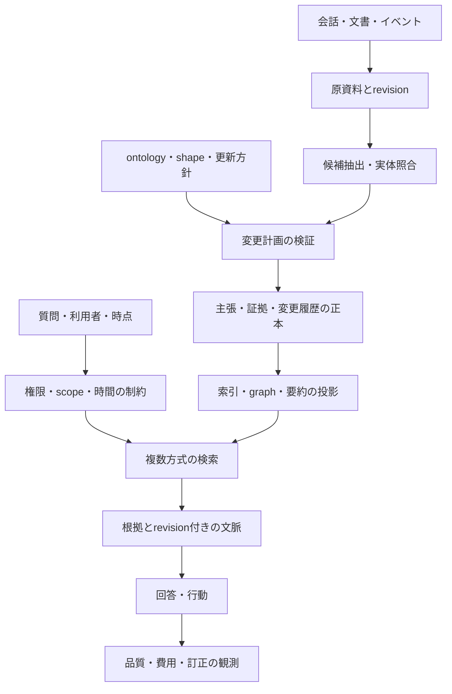

# 次世代システムの選択肢と検証仮説

[調査トップ](README.md) / [資料台帳](sources.md)

この文書は本調査の提案であり、既存研究によって性能が保証された構成ではない。先行技術の組み合わせを、そのまま新規性の主張にはしない。実装前に比較基準と反証条件を用意する。

これらの選択肢を具体的な技術スタック・データモデル・処理手順に落とした案は、[オントロジー・ナレッジシステムの推奨設計](../design/ontology-knowledge-system.md)にまとめた。汎用基盤、個人の長期記憶、専門分野への適用もそちらで扱う。

## 要件から選ぶ四つの出発点

| 出発点 | 適する要件 | 主要な利点 | 先に測るリスク |
|---|---|---|---|
| A. PostgreSQL の主張・証拠・revision＋全文/pgvector | まず訂正、監査、tenant 分離を確実にしたい | transaction と正本を一本化しやすい | 多段 graph query と形式推論は別実装になる |
| B. Graphiti を中心に episode と temporal edge | 会話中の人・物・関係の変化を探索したい | 既存の同定・照合・時間更新を利用できる | 抽出誤り、候補から漏れた矛盾、全版再現の保証 |
| C. RDF store＋小さな ontology＋SHACL | 外部語彙と相互運用し、厳密な型・公理を使う | 識別子、標準 query、検証を共有できる | モデリングと migration、時制・撤回処理の補完 |
| D. Markdown/観察ログ＋全文検索 | 人の編集、可搬性、少ない構成を重視 | 理解・修正・バックアップが容易 | 細かい主張の訂正と出典の依存管理 |

それぞれの比較対象には pgvector、Graphiti、Cognee/OntoGPT、Letta/Basic Memory/Mastra がある。A が十分な性能を出すなら、graph を追加する理由を個別に示す。C が必要な領域なら、語彙制約を後付けする費用も比較に入れる。[D-PGV] [C-GUPDATE] [C-COGONTO] [D-ONTOGPT] [C-LMEM] [D-MASTRA]

## 検証用の最小データ契約

| レコード | 必要な情報 | 分離する理由 |
|---|---|---|
| Source / SourceRevision | 原資料、hash、取得時刻、作成主体、利用権限 | 再抽出と削除の起点 |
| Mention | 原文中の範囲、候補 entity ID、同定の状態 | 誤った実体統合を取り消す |
| Assertion / Revision | subject、predicate、object、polarity、modality、scope、二つの時間 | 状態変化・訂正・仮定を区別 |
| EvidenceSupport | どの source span がどの主張を支持・反証するか | 一主張に複数の独立根拠を持つ |
| Derivation | 入力 claim revision、rule/model/prompt の版、出力 | 根拠の撤回を派生物へ伝える |
| OntologyVersion / PolicyVersion | 語彙、公理、shape、関係ごとの更新方針 | schema と更新方針の変化を監査 |
| Projection | vector、全文索引、graph、要約、適用済み event | 正本から再構築できるようにする |

source と assertion を 1 対 1 の列だけで結ぶと、別資料の支持や転載の由来を表しにくい。EvidenceSupport を独立にするのは provenance と TMS の考え方を実装へ取り込む仮説である。[T-PROVENANCE] [T-TMS]

## 候補アーキテクチャ

各箱を独立したサービスにする必要はない。最初は単一プロセスと一つの正本で実装し、索引が必要になった所だけ投影を分ける。個別 DB の性能より、意味的な契約を先に試験する。

## 優先して反証する仮説

| 仮説 | 変える要素 | 比較相手 | 測定する結果・反証 |
|---|---|---|---|
| H1: ライフサイクルの明示が stale fact を減らす | 有効期間、slot、retraction mask | 素朴な追加蓄積、同じメタデータを持つ未分類方式 | 正答、stale rate、棄却率。型を足しても改善しなければ型の効果とは言わない |
| H2: 根拠依存の追跡が訂正を局所化する | EvidenceSupport と Derivation | 全再構築、単純上書き | 撤回後に残る誤結論、正しい結論の誤削除、再計算費用 |
| H3: ontology 制約は新規概念との両立が必要 | strict / soft / schema-free extraction | 同じ抽出モデル | 型違反、抽出 recall、未知概念の保留品質、migration 費用 |
| H4: 事実の信頼性と経験の効用を分けると負の転移が減る | truth/evidence と utility を別値で保存 | 一つの importance score | 正しいが役に立たない情報と、有用だが未検証の手順を区別できるか |
| H5: 階層化は小さい文脈での回答を改善する | episode→claim→summary の選択 | 全文検索、profile、観察ログ | 固定 token 予算下の回答品質、細部の消失、索引構築費用 |

H1 は Fortunate Recall の型あり／なしの比較、H2 は TMS/provenance、H3 は LLMs4OL と Cognee、H4 は MemRL、H5 は RAPTOR / Hindsight / Mastra の発想に対応する。[P-FR] [T-TMS] [P-LLMOL] [C-COGSTRICT] [P-MEMRL] [P-RAPTOR] [D-HIND] [D-MASTRA]

## 実験の順序

1. **データ契約。** 少量の日本語例で、変化・訂正・引用・否定・併存・削除を人手で正解化する。何を答えないべきかも記録する。
2. **基準線。** 同じ回答器で、全文、dense、hybrid、profile、観察ログを比較。全履歴が収まる範囲では full context も残す。
3. **更新。** 入力を時系列で一件ずつ増やし、各段階の正本と回答を検査する。最終状態だけの比較にしない。
4. **構造。** 同一予算で Graphiti / Hindsight / RDF 制約付きの構成を加え、型・時間・来歴の寄与を ablation で分ける。
5. **外部評価。** LongMemEval、HaluMem、MemoryArena を組み合わせ、独自例に適合し過ぎていないかを見る。
6. **運用。** 削除・再索引・モデル交換・並行入力の後でも同じ契約が守られるかを確認する。

性能目標は用途とデータ量を決めた後に固定する。初期段階では、回答が良くなった根拠を paired な比較と信頼区間で示し、費用増と誤削除も同時に報告する。ベンチマークで優れた名前を選ぶより、今回の入力・更新・問い合わせの一連の挙動を説明できることを採用基準にする。

## 関連ドキュメント

- [知識更新の理論と実装](foundations/knowledge-updates.md)
- [評価と再現実験の設計](evaluation.md)
- [実装基盤の選択肢](implementation/infrastructure.md)

[D-PGV]: https://github.com/pgvector/pgvector
[C-GUPDATE]: https://github.com/getzep/graphiti/blob/6b4b56ff6f4b1e4e69c3c3c5487cf1b8762c483a/graphiti_core/utils/maintenance/edge_operations.py
[C-COGONTO]: https://github.com/topoteretes/cognee/blob/c4cd8ceb9509dff6bddfabdadbeab7cc040bc32b/cognee/modules/ontology/rdf_xml/RDFLibOntologyResolver.py
[D-ONTOGPT]: https://github.com/monarch-initiative/ontogpt/blob/main/docs/custom.md
[C-LMEM]: https://github.com/letta-ai/letta-code/blob/c864f1532b328aab4bb76cc68a86d5f014de27b8/src/agent/memory-filesystem.ts
[D-MASTRA]: https://mastra.ai/research/observational-memory
[T-PROVENANCE]: https://web.cs.ucdavis.edu/~green/papers/pods07.pdf
[T-TMS]: https://www.sciencedirect.com/science/article/pii/0004370279900080
[P-FR]: https://arxiv.org/abs/2609.10413v1
[P-LLMOL]: https://arxiv.org/abs/2307.16648v2
[C-COGSTRICT]: https://github.com/topoteretes/cognee/blob/c4cd8ceb9509dff6bddfabdadbeab7cc040bc32b/cognee/modules/ontology/construct_data_points_and_edges_with_ontology.py
[P-MEMRL]: https://arxiv.org/abs/2601.03192v2
[P-RAPTOR]: https://arxiv.org/abs/2401.18059v1
[D-HIND]: https://github.com/vectorize-io/hindsight/blob/8924a5bcfd6ff64fb20cace098021a3b61e76391/README.md
