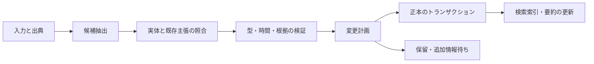

# 与えられた情報による知識更新

[調査トップ](../README.md) / [資料台帳](../sources.md)

このページは、[メモリーの管理操作](memory.md)と[オントロジーの意味論](ontology.md)を、新情報を受け取った時の処理へつなぐ。

## 新情報を「更新」と呼ぶ前に分類する

| 入力例                     | 起きたこと     | 望ましい処理                 |
| ----------------------- | --------- | ---------------------- |
| 「Alice は東京に住む」→同じ内容の再確認 | 支持が増えた    | 主張の重複を避け、証拠を追加         |
| 「大阪へ引っ越した」              | 世界の状態変化   | 東京の有効区間を閉じ、大阪の区間を開始    |
| 「転居日は 4 月ではなく 5 月だった」   | 過去の認識の訂正  | 有効期間の再解釈と記録上の revision |
| 「東京と大阪に住居がある」           | 複数値の併存    | 排他的関係だと決めつけない          |
| 「A 社の記事は誤報だった」          | 根拠の信頼性の変更 | 依存する主張・要約を再評価          |
| 「来月大阪へ移る予定」             | 将来の計画     | 実現済みの事実と分ける            |
| 「大阪には住んでいない」            | 明示的否定     | 不明・未記載・肯定と区別           |
| 「この情報を忘れて」              | 利用・保存の撤回  | 検索除外と派生データの処理          |
| 名前が同じ別人の情報              | 実体同定の問題   | 同一人物の更新として処理しない        |

これは本調査の分類例である。具体的な業務では、関係ごとに単一値・多値、適用範囲、情報源の優先順位を定義する。

## 信念改訂と状態更新

AGM は、新情報を取り入れる revision、信念を外す contraction、矛盾を考慮しない expansion などを区別し、必要以上に既存知識を変えない性質を論じる。Katsuno–Mendelzon に連なる研究は、変わらない世界について認識を修正することと、世界が変化したことの反映を区別する。[T-AGM] [T-UPDATE]

LLM メモリーでの `UPDATE` はこれらを一つの動詞へ押し込めがちである。採用すべき方針は、たとえば「最新の自己申告は現住所を更新できるが、出生日の訂正には根拠を要求する」のように predicate と source class に依存する。AGM の公理をそのまま全自然言語へ実装する必要はなく、変更種別を明確にするための理論的土台として使える。

## 根拠が消えた時の結論

TMS は「なぜその結論を採用しているか」を記録し、仮定の変更に合わせて結論を再検討する。データベース側でも provenance と incremental view maintenance は、入力変更がどの結果へ影響するかを扱ってきた。[T-TMS] [T-PROVENANCE] [T-DRED]

例として、`E1 → C1`、`E2 → C1`、`C1 ∧ C2 → C3` という依存を持つなら、E1 を消しても E2 が有効なら C1 を残せる。C1 の支持が完全になくなれば C3 を再評価する。ただし独立した二資料に見えて同じ一次資料を転載している場合は、支持を二重に数えない。

LLM 生成の要約や一般化を論理的に完全な derivation とみなすのは難しい。現実的には「影響を受ける派生物を特定して stale にし、再計算する」という保守的な方式を最初の比較対象にする。証拠の数、抽出の confidence、出典の信頼度、問い合わせへの relevance は異なる値として持つ。

## 二つの時間を使った例

入力は次の順で到着したとする。

1. 4 月 10 日: 「4 月 1 日に A 社から B 社へ転職した」。
2. 6 月 1 日: 「先ほどの転職日は誤りで、正しくは 5 月 1 日」。

| 記録版 | 有効期間として認識する内容        | システムがその認識を持つ期間 |
| --- | -------------------- | -------------- |
| r1  | 4/1 より前は A、4/1 以降は B | 4/10 から 6/1 未満 |
| r2  | 5/1 より前は A、5/1 以降は B | 6/1 以降         |

「4/15 の勤務先を 5/10 時点の認識で答える」と B、「4/15 の勤務先を最新の訂正に従って答える」と A になる。これが有効時刻と記録時刻を分ける理由である。[D-XTDB]

半開区間 `[from, to)` を用いると境界の重複を扱いやすい。開始日不明と無期限は別に表す。日付だけの情報に勝手に秒精度を付けず、timezone、日付精度、相対表現の基準日、推定か明示かを保存する。Graphiti の四 timestamp は有用な実例だが、全 revision を再現できるかは別に試験する。[C-GEDGE] [C-GUPDATE]

## どの層を更新するのか

「メモリーを更新する」という表現だけでは、変更する対象が曖昧になる。次の区別は本調査の設計上の整理である。

**知識の内容・意味・運用を分ける**

|           | 例                 | 確認すること                 |
| --------- | ----------------- | ---------------------- |
| 原資料の更新    | 文書の訂正版が公開された      | 旧版と新版、引用範囲、取り込み時点の対応   |
| 主張の更新     | 所属の開始日が訂正された      | どの有効期間・認識期間・根拠が変わるか    |
| オントロジーの更新 | 所属を雇用・共同研究・訪問に分けた | 旧関係の意味、移行先、過去の問いへの影響   |
| 制約・方針の更新  | 主な勤務先の採用条件を変えた    | どの版の方針で採用したか、再審査が必要か   |
| 派生データの更新  | 要約や埋め込みを再計算した     | 正本のどの版から生成され、何が未反映か    |
| モデルの更新    | 抽出モデルを交換した        | 保存済み主張の扱い、再抽出による差、評価条件 |

語彙の変更によってラベルを置換できても、意味が一対一に対応するとは限らない。たとえば「所属」から「雇用」へ移すには、過去の原文で区別できるかを確認する。記憶の種類と管理操作は[メモリー](memory.md)、語彙・公理の設計と進化は[オントロジー](ontology.md)、両者をつなぐ例は[応用編](ontology-memory-applications.md)を参照。

## 更新パイプラインの設計案

これは本調査の提案。変更計画は `add_evidence`、`supersede`、`correct_validity`、`mark_disputed`、`retract_source`、`split_entity` 等を明示する。抽出器に DB の任意更新を任せず、対象 ID・現在版・根拠・変更理由を持つ計画を検査できるようにする。

## 同時書き込みと再実行

保存の競合には optimistic concurrency、同じ入力の再送には idempotency key、正本から別索引への伝播には transactional outbox が候補になる。LLM 呼び出しは再試行で別結果になり得るため、原入力だけでなく採用した抽出結果、model ID、prompt/schema 版を残す。[D-OUTBOX] [D-EVENT]

Event Sourcing は変更イベントから状態を再構築する方法で、自然言語を再抽出して同じ状態になる保証ではない。CRDT はレプリカの収束を扱うが、「A と B のどちらが正しい勤務先か」を解決しない。データ構造の収束と知識の整合性を混ぜない。[D-EVENT] [T-CRDT]

## 忘却・無効化・削除

- **検索優先度の減衰**: 重要でない項目を上位に出さなくする。事実が偽になったわけではない。
- **有効期間の終了**: 現在の答えには使わないが、過去の問いには使える。
- **根拠の撤回**: そのソースで支えた結論と派生物を再評価する。
- **利用停止・消去**: 検索、要約、キャッシュ、復元処理から再び利用されないようにする。

TTL を過ぎた予定をすべて消すと「その時何を予定していたか」に答えられなくなる。逆に期限切れでも保管しているからといって、現在の事実として返してよいわけではない。政策上の保持と、意味上の有効性を二つの独立した軸にする。[P-FR]

## 関連ドキュメント

- [メモリーの基礎と応用](memory.md)

- [オントロジーとメモリーを組み合わせる実例](ontology-memory-applications.md)

- [時間・グラフ・統合メモリーの実装](../systems/structured-memory.md)

- [更新シナリオの評価](../evaluation.md)

- [設計の選択肢と検証仮説](../design-directions.md)

[T-AGM]: https://doi.org/10.2307/2274239

[T-UPDATE]: https://arxiv.org/abs/cs/9903016

[T-TMS]: https://www.sciencedirect.com/science/article/pii/0004370279900080

[T-PROVENANCE]: https://web.cs.ucdavis.edu/~green/papers/pods07.pdf

[T-DRED]: https://doi.org/10.1145/170036.170066

[D-XTDB]: https://docs.xtdb.com/concepts/key-concepts.html

[C-GEDGE]: https://github.com/getzep/graphiti/blob/6b4b56ff6f4b1e4e69c3c3c5487cf1b8762c483a/graphiti_core/edges.py

[C-GUPDATE]: https://github.com/getzep/graphiti/blob/6b4b56ff6f4b1e4e69c3c3c5487cf1b8762c483a/graphiti_core/utils/maintenance/edge_operations.py

[D-OUTBOX]: https://debezium.io/documentation/reference/stable/transformations/outbox-event-router.html

[D-EVENT]: https://martinfowler.com/eaaDev/EventSourcing.html

[T-CRDT]: https://dsf.berkeley.edu/cs286/papers/crdt-tr2011.pdf

[P-FR]: https://arxiv.org/abs/2609.10413v1
