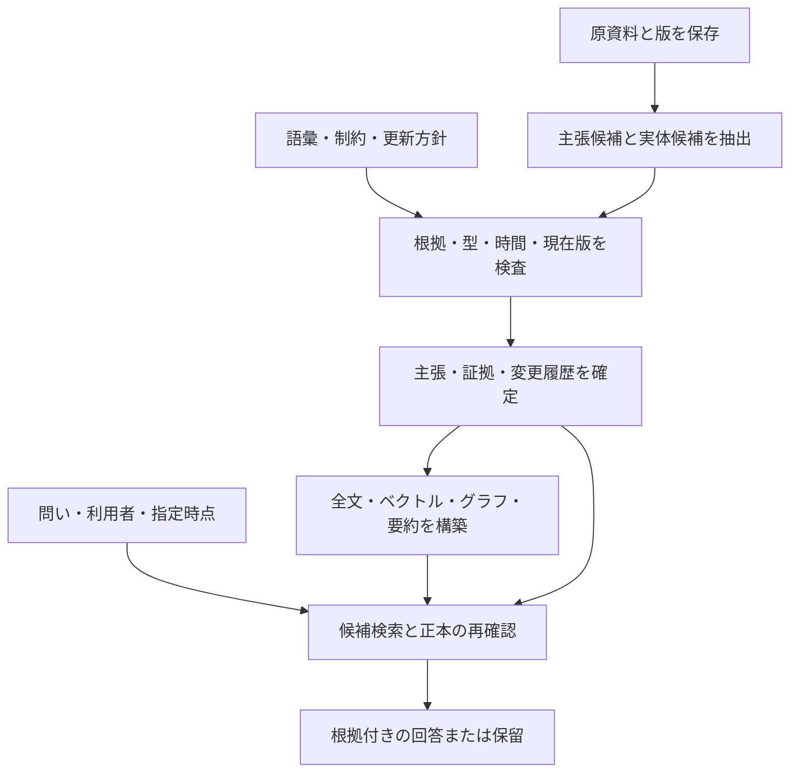

# オントロジーとメモリーを組み合わせる：基礎から応用への実例

[調査トップ](../README.md) / [基本概念](concepts.md) / [資料台帳](../sources.md)

**確認日: 2026-09-29。** 標準仕様の役割を、原資料の取り込みから検索・訂正までの一つの例に結び付ける。以下の人物・組織・データは説明用に作った架空の例であり、既存製品の実装や性能測定の結果ではない。

## 最初に答えたい問いを決める

対象は、会話から人物の所属を記憶するアシスタントとする。「所属している」をどう表現するかに加え、いつの所属か、誰の発言か、後から訂正されたかを答えたい。

| 問い                      | 必要になる情報                |
| ----------------------- | ---------------------- |
| 葵さんは、指定した日にどの組織に所属していたか | 人物・組織の識別子、所属の有効期間      |
| その答えは、どの発言に基づいているか      | 原資料の版、引用範囲、主張との対応      |
| 訂正を知る前には、どう認識していたか      | 主張の版と、その認識を保持した期間      |
| 同じ組織への兼業と主な勤務先を区別できるか   | 関係の意味、役割、適用範囲、単値・多値の方針 |
| 根拠が撤回されたら、何を答えなくなるか     | 支持・反証と、派生した主張や要約への依存関係 |

このような「知識基盤が答えられるべき問い」を先に決める考え方が competency questions である。以下の問いとモデルの組み合わせは本調査の設計例である。[D-ONTO101]

## 同じ入力を、五つの層で読む

2026 年 4 月 10 日に「葵です。4 月 1 日から青空研究所で働いています」と発言したとする。ここで、発言の存在と、その内容が現実に正しいことを分けて扱う。

**一つの入力に対する異なる責務**

|           | この例で保持するもの                     | その層だけでは決まらないもの        |
| --------- | ------------------------------ | --------------------- |
| 原資料・エピソード | 誰がいつ何と発言したか                    | 発言が誤り・引用・仮定ではないか      |
| オントロジー    | Person、Organization、所属という関係の意味 | 今回の葵がどの人物か、実際の所属が正しいか |
| 主張・意味記憶   | 葵と青空研究所の所属を、期間・根拠付きで採用した記録     | 別の資料による訂正や対立の処理       |
| 制約・更新方針   | 必須の根拠、対象の型、併存や置換の条件            | 根拠自体の信頼性、未到着の訂正       |
| 検索・作業文脈   | 今回の問いに使える主張と原文の抜粋              | 取得しなかった情報、次回までの長期保存   |

オントロジーと主張を同じ RDF ストアに保存することも、SQL のレコードへ語彙を対応付けることもできる。役割を区別することと、サービスや DB を分割することは別の判断である。基本的な意味論は [オントロジー](ontology.md)、記憶の分類と読み書きは [メモリー](memory.md) を参照。

## 語彙と、根拠を持つ主張を分ける

所属先だけを二項関係として保存すると、どの期間・出典の主張かを付け足しにくい。この例では、所属についての主張を独立したノードにする。関係に追加の引数や属性を持たせる設計は、W3C の N-ary relation pattern で整理されている。[S-NARY]

次の Turtle は、型・データ・原資料への参照を含む小さな例である。`ex:` の名前と採用状態の意味は本資料が定義したもので、標準のメモリー語彙ではない。

```turtle
@prefix ex: <https://example.org/memory/> .
@prefix owl: <http://www.w3.org/2002/07/owl#> .
@prefix prov: <http://www.w3.org/ns/prov#> .
@prefix xsd: <http://www.w3.org/2001/XMLSchema#> .

ex:Person a owl:Class .
ex:Organization a owl:Class .
ex:EmploymentAssertion a owl:Class .

ex:aoi a ex:Person .
ex:aozora-lab a ex:Organization .
ex:message-1 a prov:Entity .

ex:claim-1 a ex:EmploymentAssertion, prov:Entity ;
    ex:subject ex:aoi ;
    ex:employer ex:aozora-lab ;
    ex:validFrom "2026-04-01"^^xsd:date ;
    ex:knownFrom "2026-04-10T09:00:00+09:00"^^xsd:dateTime ;
    ex:status ex:accepted ;
    prov:wasDerivedFrom ex:message-1 .
```

`prov:wasDerivedFrom` は、主張の記録がどの資料から作られたかを表す。資料を真正・正確と認定する属性ではない。PROV では資料などの Entity、生成・編集の Activity、責任を持つ Agent を関連付けられる。[S-PROV] [S-PROV-PRIMER]

この例は `ex:aoi ex:worksFor ex:aozora-lab` を無条件に追加していない。主張の採否・権限・時点を検査した後に、必要な問い合わせ用グラフを作る方針にできる。原文、原文中の範囲、取り込み主体、語彙・抽出器の版は、本番のデータ契約では追加する。

## SHACL で「記録の形」を検査する

次は、所属の主張に人物・組織・根拠を要求する shape の例である。`sh:class` は値の型、`sh:minCount` と `sh:maxCount` は値の個数を検査する。[S-SHACL]

```turtle
@prefix ex: <https://example.org/memory/> .
@prefix sh: <http://www.w3.org/ns/shacl#> .
@prefix prov: <http://www.w3.org/ns/prov#> .

ex:EmploymentShape a sh:NodeShape ;
    sh:targetClass ex:EmploymentAssertion ;
    sh:property [
        sh:path ex:subject ;
        sh:class ex:Person ;
        sh:minCount 1 ;
        sh:maxCount 1
    ] ;
    sh:property [
        sh:path ex:employer ;
        sh:class ex:Organization ;
        sh:minCount 1 ;
        sh:maxCount 1
    ] ;
    sh:property [
        sh:path prov:wasDerivedFrom ;
        sh:nodeKind sh:IRI ;
        sh:minCount 1
    ] .
```

次の表は仕様とコードの静的な確認に基づく期待結果である。この調査では RDF パーサ、SHACL 検証器、SPARQL エンジンで例を実行していない。

| データの変更                | この shape で期待する結果        |
| --------------------- | ----------------------- |
| 上のデータをそのまま与える         | この shape の制約に適合する       |
| 主張から根拠へのリンクを削除する      | 根拠の最小個数に違反する            |
| 組織を指す値を文字列「青空研究所」に変える | 組織という型の検査に違反する          |
| 根拠の文章を、型が整った誤情報に変える   | この shape だけでは誤情報を検出できない |

ここでの `maxCount 1` は「一つの主張が指す所属先」の個数である。同一人物が複数の主張を持つことや、兼業を禁止する制約ではない。時間の整合、主な勤務先の排他性、原文と主張の対応も、この shape には含めていない。これらは追加の shape・DB 制約・更新方針で扱う。

## 記憶として取り込み、必要な時だけ読み出す



この流れは本調査の設計案である。LLM は候補の抽出や曖昧な表現の解釈に使い、候補を採用する条件をアプリケーションで検査する。失敗した原文を捨てず、未構造化の資料として残す方針も選べる。

探索的な質問は全文・ベクトル検索、識別子と期間が分かる質問は構造化照会が候補になる。どの取得方法でも、採用状態、時点、権限、有効な根拠を確かめてから外部モデルへ渡す。順位の高さを事実の信頼性として扱わない。

次の SPARQL は、**利用者と対象時点について絞り込み済みのグラフ**から、採用した主張と根拠を取り出す最小例である。SPARQL の基本グラフパターンと `SELECT` を使っている。[S-SPARQL-QUERY]

```sparql
PREFIX ex: <https://example.org/memory/>
PREFIX prov: <http://www.w3.org/ns/prov#>

SELECT ?claim ?person ?organization ?source
WHERE {
    ?claim a ex:EmploymentAssertion ;
           ex:subject ?person ;
           ex:employer ?organization ;
           ex:status ex:accepted ;
           prov:wasDerivedFrom ?source .
}
```

上のデータだけなら `claim-1 / aoi / aozora-lab / message-1` が結果となる。これは根拠のリンクを取得する照会であり、原文へのアクセス権、根拠の失効、期間の絞り込みを実装した照会ではない。空の結果は「条件に合う主張が取得できない」ことであり、「所属していない」という明示的な否定とは区別する。

## 訂正・撤回・削除を通して考える

### 世界の変化と認識の訂正

5 月 20 日に「研究所を退職した」と分かる場合は、所属の有効期間を閉じる。一方、6 月 1 日に「所属開始日は 4 月 1 日ではなく 5 月 1 日だった」と分かる場合は、過去の認識を訂正する。ここでは後者だけを採用した場合を考える。

| 問い                             | 期待する回答                      |
| ------------------------------ | --------------------------- |
| 4 月 15 日の所属を、5 月 10 日時点の認識で答える | 青空研究所への所属を採用していた            |
| 4 月 15 日の所属を、6 月 10 日時点の認識で答える | 訂正された開始日前なので、この主張では所属を支持しない |
| 5 月 15 日の所属を、6 月 10 日時点の認識で答える | 青空研究所への所属を支持する              |

この例は以前の所属先を保存していないため、4 月 15 日の別の勤務先までは答えられない。有効期間とシステムが認識していた期間を分ける双時間の考え方は、[知識更新](knowledge-updates.md)で詳しく扱う。[D-XTDB]

### 根拠の撤回と複数の支持

二つの独立した資料が同じ主張を支持しているなら、一つの撤回だけで主張全体を消さない。一方、同じ発言から生成した要約を別の独立した証拠として数えると、誤りを自己強化する。どの原資料とどの主張の版を使ったかをたどり、影響を受けた要約を再評価する。これは来歴表現を用いたアプリケーションの更新方針であり、PROV を使うだけで自動的に実行されるものではない。[S-PROV-PRIMER]

### 消去と再構築

検索順位を下げること、現在の事実として採用しなくなること、保存内容を消すことは異なる。消去を約束するなら、原資料・主張・埋め込み・要約・キャッシュの対象範囲を定義し、復元や再索引で復活させない契約を設ける。具体的な手順は[推奨設計](../../design/ontology-knowledge-system.md)にまとめている。

## 応用先によって、厳密にする部分が変わる

以下は、ここまでの概念を要件に対応付けた本調査の分析である。

**用途別の設計判断**

|            | オントロジーの主な役割      | メモリーの主な役割            | 優先して評価すること                          |
| ---------- | ---------------- | -------------------- | ----------------------------------- |
| 個人アシスタント   | 人・予定・嗜好・状況の区別    | 会話をまたぐ好みや予定の保持と訂正    | 過度な一般化、撤回、知らない問いへの保留                |
| 研究支援       | 文献・主張・実験・指標・版の対応 | 読解メモ、反証、出典、研究上の判断の履歴 | 原論文へ戻れるか、異なる実験条件を混同しないか             |
| 業務ナレッジ     | 組織・製品・手順・規程の共通語彙 | 文書改訂、期限、担当変更、過去の判断   | 指定時点と権限で正しい根拠を返せるか                  |
| 専門分野のデータ統合 | 外部識別子、公理、制約の共有   | データ改訂と語彙の版の保持        | competency questions、型違反、未知概念の取りこぼし |
| 行動するエージェント | 道具・状態・手順・適用条件の区別 | 過去の試行と結果を次の行動に使う     | 環境が変わっても有効か、誤った経験の再利用               |

個人の好みが一度の発話で永久に確定するわけではない。研究結果の数値はモデルやデータ条件を伴い、手順の成功経験は環境の版を伴う。記憶する対象に合わせて、適用条件と更新の単位を決める。

### 導入範囲を小さく決める

**要件から始める構成の選択**

|                | 最初に試す構成          | 構造を追加する契機               |
| -------------- | ---------------- | ----------------------- |
| 人が読み書きする少量のノート | 原文・版・全文検索        | 同一人物や訂正の追跡が難しくなる        |
| 文書 QA と根拠提示    | 出典付きの文書検索と回答     | 関係をたどる問い、改訂や失効への要求が増える  |
| 時点・監査・訂正が中心    | 主張・根拠・版を持つ構造化ストア | 複数段の関係探索や外部語彙との交換が必要になる |
| 組織間で意味を共有する    | 小さな共通語彙と識別子・検証   | 公理に基づく含意が具体的な問いに必要になる   |

全資料を構造化する必要はない。対象の語彙で表せない文章は原文で保持し、未知のクラス・関係は候補として扱う。オントロジーを拡張したら、以前の資料を再検証するか、再抽出するか、旧版として残すかを決める。

## 基礎から応用へ進めたかを確かめる

品質は用途に対する適合として考える。W3C DQV は品質の情報を記録する語彙を提供するが、あらゆる用途に共通する唯一の品質定義や合格点を与えるものではない。[D-DQV]

| 評価の層  | この例で確認する内容                  |
| ----- | --------------------------- |
| 語彙・公理 | 所属と訪問、人物と組織を混同しない。必要な問いを表せる |
| 抽出    | 仮定・引用・否定を実際の所属へ変換しない        |
| 保存・更新 | 遡及訂正、複数根拠、兼業、二重入力を区別する      |
| 検索    | 条件に合う主張と必要な原文を回収する          |
| 回答・行動 | 根拠を超えて断定せず、不足や対立を説明する       |
| 運用    | 権限変更・消去・復元後も約束した扱いを維持する     |

同じ抽出器・回答器・文脈予算で、語彙制約、時間管理、来歴追跡を一つずつ加える比較を行う。単に「オントロジーあり」と「なし」の平均正答率を比べるだけでは、どの要素が寄与したか分からない。具体的な指標は[評価方法](../evaluation.md)、反証可能な仮説は[設計・実験案](../design-directions.md)を参照。

理解を確認するため、次の問いを自分の用途に置き換えるとよい。

1. 一つの発言から、原資料・主張・意味の定義をそれぞれ取り出せるか。
2. shape を通る誤情報と、正しい内容だが shape に違反する入力を作れるか。
3. 「現在は使わない」「根拠を撤回した」「物理的に消した」を区別できるか。
4. 語彙を増やすことで改善する問いと、抽出漏れが増える問いを挙げられるか。

## 関連ドキュメント

- [メモリー、知識、オントロジーの関係](concepts.md)
- [オントロジーと知識表現](ontology.md)
- [メモリーの基礎と応用](memory.md)
- [知識更新の理論と実装](knowledge-updates.md)
- [システム比較](../systems/README.md)
- [推奨技術スタックとデータ契約](../../design/ontology-knowledge-system.md)

[D-ONTO101]: https://protege.stanford.edu/publications/ontology_development/ontology101-noy-mcguinness.html

[S-NARY]: https://www.w3.org/TR/swbp-n-aryRelations/

[S-PROV]: https://www.w3.org/TR/prov-o/

[S-PROV-PRIMER]: https://www.w3.org/TR/prov-primer/

[S-SHACL]: https://www.w3.org/TR/shacl/

[S-SPARQL-QUERY]: https://www.w3.org/TR/sparql11-query/

[D-XTDB]: https://docs.xtdb.com/concepts/key-concepts.html

[D-DQV]: https://www.w3.org/TR/vocab-dqv/
