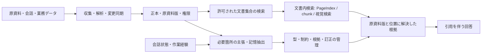

# 関連システムの再調査：メモリー・文書検索・意味データ基盤

[調査トップ](../README.md) / [既存システム比較](README.md) / [資料台帳](../sources.md)

確認日: 2026-09-29。既存調査を起点に、メモリー製品だけでなく、文書集合の探索と同期、経験の再利用、意味データの管理、クラウド・実行基盤まで調査範囲を広げた。結論は、**PageIndex と比較すべき文書検索候補と、PageIndex に組み合わせる記憶・更新・意味管理の候補を分ける必要がある**ということである。

今回の追加・深掘り対象は、後掲の分野別文書と[候補台帳](../evidence/system-landscape.json)にまとめた。世界中の製品を漏れなく列挙したという意味での網羅ではなく、今回の設計に必要な役割ごとに探索し、重複・採用・保留の理由を記録した調査である。既存の主要システムも比較対象として残し、本文で新規性と確認の深さを区別する。

**追加確認の規模:** 50 系統（メモリー・経験 14、文書検索 15、意味データ 11、クラウド・実行基盤 10）。製品・ライブラリ・研究方式を含む。追加確認なしの MemMachine の再掲、MemoryData の評価研究、要旨のみの補足論文、歴史的参考・探索保留はこの件数に含めない。固定版の取得記録は 8 リポジトリ・22 ファイルで、選択したコード・公式文書・LICENSE を含む。

## 分野別のドキュメント

**調査の入口**

|           | 今回広げた範囲                        | 主な比較対象                                               | 詳細                          |
| --------- | ------------------------------ | ---------------------------------------------------- | --------------------------- |
| メモリーと経験   | 前回の概要候補の深掘り、ファイル・手順・経験の共有      | memU・OpenViking・MemoryOS・ReMe・AGENT KB 等             | memory-landscape.md         |
| 文書検索と RAG | 文書集合の発見・同期、構築フレームワーク、視覚 PDF 検索 | RAGFlow・Dify・Onyx・LlamaIndex・Haystack・ColPali 等      | retrieval-landscape.md      |
| 意味データ基盤   | RDF / 推論、仮想化、語彙ガバナンス、型・履歴      | GraphDB・RDFox・Stardog・Ontop・TypeDB・XTDB 等            | semantic-data-landscape.md  |
| クラウド・実行基盤 | 抽出サービス、session、経験ファイル、文書の版     | AgentCore・Memory Bank・Foundry・OpenAI・Claude・CrewAI 等 | managed-memory-landscape.md |

詳細: [メモリーと経験](memory-landscape.md)、[文書検索と RAG](retrieval-landscape.md)、[意味データ基盤](semantic-data-landscape.md)、[クラウド・実行基盤](managed-memory-landscape.md)。各製品の事実確認と一次資料への参照は、分野別文書に置いた。

## 前回から広がった論点

### 文書の内部探索と、文書集合の管理は別の問題

PageIndex の強みとして検討するのは、文書構造を読み、該当ページへ進む検索である。一方、組織内で文書 QA を継続運用するには、接続元の発見、追加・変更・削除の同期、許可された文書の選択も必要になる。RAGFlow、Dify、Onyx はこの周辺の構成を比較する対象で、LlamaIndex、Haystack、Pathway 等は処理を組む部品の候補になる。[文書検索の比較](retrieval-landscape.md)では、既成アプリとライブラリを区別した。

図表・画像・レイアウトが鍵になる質問には、ColPali / ColQwen2 のようなページ画像検索や RAG-Anything を含める。[前回の PageIndex 確認](pageindex.md)で見たローカル Flash の対象・制限と、視覚検索の対象は同じではない。構造検索だけを全 PDF の代表方式として評価しない。

### 長期記憶の対象は、人物情報から作業経験まで広い

前回の Mem0、Graphiti、Hindsight、Letta 等に加え、memU / OpenViking のファイル・階層管理、MemoryOS の記憶階層、ReMe や AGENT KB 等の経験再利用を比較する。[メモリーと経験の調査](memory-landscape.md)では、ユーザーの好みを正しく覚える能力と、過去の失敗から次の作業を改善する能力を分けた。

クラウドや SDK にも経験の記憶がある。たとえば AgentCore の episodic strategy と OpenAI Sandbox Memory は、単に会話ログを保存する機能とは用途が異なる。実行状態の保存、内容の抽出、経験の一般化を分離して比較する。[D-LC-AWS-STRATEGY] [D-LC-OAI-SANDBOX]

### オントロジーを扱う基盤は、知識グラフを生成する RAG と同一ではない

RDFox / GraphDB の推論、Stardog / Ontop のデータ仮想化、TopBraid EDG / eccenca / TriplyDB の語彙やデータ管理、Palantir Ontology のオブジェクトと操作は、異なる責務を持つ。製品名に graph や ontology があっても、OWL の意味論、SHACL の検証、アプリの型スキーマ、業務操作を同じ能力として数えない。[意味データ基盤の比較](semantic-data-landscape.md)

**本調査の判断:** 正本を PostgreSQL に置く現行案を直ちに置き換える根拠は得ていない。ただし、既存 RDF 資産の統合や複雑な推論が主要要件になるなら、意味データ基盤を後付けの検索機能としてではなく、別の構成案として比較する価値がある。

### 「履歴がある」の意味を分ける必要がある

Google Memory Bank の fact revision、Claude Managed Agents の文書版、TerminusDB の commit、XTDB の二時点管理、LangGraph の checkpoint は、保持する対象と使い道が違う。Google では改訂履歴の無効化・期限と削除後の復元窓も明示されている。API に delete や rollback があることだけで、主張の根拠撤回や完全な消去が実現するとは判断しない。[D-LC-GOOGLE-REVISIONS] [D-LC-CLAUDE-STORE] [D-LC-LANGGRAPH] [意味データ基盤の比較](semantic-data-landscape.md)

**同じ名称で比較しないための区別**

|                             | 主に保持するもの               | 今回の設計で別に必要なもの           |
| --------------------------- | ---------------------- | ----------------------- |
| session / checkpoint        | 実行や会話を再開する状態           | 事実の同定、訂正理由、根拠           |
| 文書版・memory revision・commit  | 編集または統合ごとの過去状態         | 実世界での有効時刻と、知識取得時点の定義    |
| 双時間データ                      | 有効時刻とシステム時刻で問い合わせられる履歴 | 抽出した主張の真偽判定と根拠の支持関係     |
| scope / namespace / user ID | 保存・検索・分離の指定            | 認証済み利用者が指定可能な範囲の決定      |
| 引用・source metadata          | 参照先の表示や追跡用の情報          | 原資料版と位置への解決、回答を支えるかの確認  |
| delete API                  | 対象リソースの削除要求            | 派生物・履歴・再取り込みも含めた削除の完了条件 |

この表は用語を比較するための分析であり、すべての製品に同じ欠陥があるという観測ではない。個別の保証は詳細ページと実験で確認する。

## 現行設計への配置

下図は導入済み構成ではなく、候補をどの役割で比較するかを示す。製品間を接続する adapter とデータ契約の実装は別途必要になる。

**用途に応じた比較候補**

|                  | まず比較する候補                                            | 比較して判断すること                    |
| ---------------- | --------------------------------------------------- | ----------------------------- |
| 長いテキスト PDF の根拠探索 | 既存 PageIndex と全文・chunk 検索の基準構成                      | 正しい原ページへの到達、探索費用、棄却           |
| 図表中心・スキャン PDF    | ColPali / ColQwen2・RAG-Anything と OCR を含む基準構成       | ページ検索と回答を分けた精度、引用位置           |
| 接続元が多い組織内文書 QA   | Onyx・RAGFlow・Dify                                   | 同期・削除・権限の適用点、機能の提供 edition    |
| 独自の取り込み・検索を組む    | LlamaIndex・Haystack・Pathway                         | 原資料 ID と版の引き継ぎ、再投入、処理の差し替え    |
| 個人化と時間付きの関係記憶    | 既存 Mem0・Graphiti・Hindsight と追加メモリー群                 | 訂正と世界の変化、根拠の撤回、書き込み費用         |
| agent の作業経験・手順共有 | ReMe・AGENT KB・既存 Letta と sandbox / file memory      | 成功した手順の再利用、誤った手順の撤回、評価データへの漏洩 |
| RDF 資産の統合と推論     | GraphDB・RDFox・Stardog・Ontop                         | 対応する推論・仮想化の範囲、更新と問い合わせの費用     |
| 型と時刻を重視する保存層     | PostgreSQL の現行案と TypeDB・TerminusDB・XTDB             | 型制約、commit 履歴、双時間を要件別に比較      |
| サービスに記憶処理を委ねる    | AgentCore・Memory Bank・Foundry・Claude managed memory | API の責任境界、データ搬出、履歴・TTL・削除     |

候補の役割は四つの分野別文書に示した一次資料に基づく。ここでの選択順は **本調査の設計判断** であり、優劣の実測順位ではない。同じ行でも、管理画面を含むサービスとライブラリの運用負担は揃わない。移行や採用は、[既存の評価計画](../evaluation.md)に沿う小規模比較の後で決める。

## 評価を補う研究

新しいシステム名の収集に加え、評価単位を見直す研究も確認した。MemoryData / OpenDataBox は[メモリーの詳細](memory-landscape.md)にまとめた。以下二件は今回 **要旨・書誌のみ** を確認した補足であり、方式や実験全体の精読、追試はしていない。

`Is Agent Memory a Database?` は GEM と MemState を提案し、個々のレコード操作だけでなく、取り込み・改訂・忘却・検索による状態の変遷を評価対象にする。この問題設定は、現行設計で更新と撤回を追う理由を考える参考になる。要旨にある一般的な主張を、全データベースの能力についての確定的な結論として採用してはいない。[P-LX-DATABASE]

`Agent Memory: Characterization and System Implications of Stateful Long-Horizon Workloads` v2 は、構築・検索・生成の段階ごとに費用を分け、書き込みと読み出しの設計を比較すると説明する。本調査への示唆は、検索時の遅延だけでなく、取り込み費用を何回の問い合わせで償却できるかを評価すること。個別システムの数値比較は未確認なので転載していない。[P-LX-WORKLOADS]

## 探索の範囲と重複の扱い

既存の [fact-memory](fact-memory.md)、[structured-memory](structured-memory.md)、[agent-memory](agent-memory.md)、[knowledge-retrieval](knowledge-retrieval.md)、[PageIndex](pageindex.md) を出発点に、概要のみだった候補、関連研究の比較対象、公式文書から辿れる隣接機能を再調査した。GitHub のスター数や検索順位は採用理由にしていない。

**採否と数え方**

|                              | 扱い                        | 理由                                                            |
| ---------------------------- | ------------------------- | ------------------------------------------------------------- |
| 前回の概要候補                      | 新規発見と分けて再訪。追加確認なしの項目は比較基準 | MemoryOS・memU・OpenViking・MIRIX 等の追加確認と、MemMachine の既存概要の再掲を区別 |
| 同一系統の別名・統合機能                 | 一つの系統の内訳として記述             | MemoryScope / ReMe、GraphRAG の検索戦略、SDK と service の機能差を明示       |
| 既存の主要方式                      | 既存詳細へリンクし比較に残す            | Mem0・Graphiti・Hindsight・PageIndex 等の全面再監査をしたとは扱わない            |
| 汎用 DB・parser・ontology editor | 既存の周辺基盤調査を参照              | Qdrant 等の全製品版や全 parser の列挙は今回の追加対象ではない                        |
| 研究・評価基盤                      | 製品数とは別に記録                 | MemoryData や要旨のみの補足論文を実用システムと混ぜない                             |
| 探索保留                         | 読めた範囲と保留理由を保存             | 資料不足や今回の範囲外を機能の欠如・不存在と断定しない                                   |

[候補台帳](../evidence/system-landscape.json)には対象、従来の扱い、資料 ID、役割、未確認点を、[探索記録](../evidence/landscape-searches.json)には分野別の代表クエリと選定経路を残した。検索エンジンの全結果を保存した完全な systematic review ではなく、同じ問いで追加調査しやすくする記録である。

## 確認方法と残る作業

公式文書、著者の論文、公開リポジトリを優先し、代表例についてだけ commit 固定のコードを読んだ。出典は[資料台帳](../sources.md)、取得ファイルの hash は[repository snapshots](../evidence/repository-snapshots.json)で辿れる。各ページには仕様として確認したこと、静的コードで確認したこと、本調査の判断、未確認を区別して記載した。

この調査では製品をインストールせず、サービス API の実行、性能評価、比較ベンチマーク、全依存の監査はしていない。導入する場合に次に必要なのは、同じ入力・モデル・権限・更新列・費用条件での比較である。特に誤情報の訂正、原資料の差し替え、根拠削除、権限変更を含め、回答精度と更新の正しさを別々に測る。

## 関連ドキュメント

- [PageIndex を考慮した推奨設計](../../design/ontology-knowledge-system.md)
- [共通の評価方法](../evaluation.md)
- [調査方法と根拠の扱い](../methodology.md)
- [周辺ライブラリと基盤](../implementation/infrastructure.md)

[P-LX-DATABASE]: https://arxiv.org/abs/2605.26252v1

[P-LX-WORKLOADS]: https://arxiv.org/abs/2606.06448v2

[D-LC-AWS-STRATEGY]: https://docs.aws.amazon.com/bedrock-agentcore/latest/devguide/long-term-configuring-built-in-strategies.html

[D-LC-OAI-SANDBOX]: https://developers.openai.com/api/docs/guides/agents/sandboxes

[D-LC-GOOGLE-REVISIONS]: https://docs.cloud.google.com/gemini-enterprise-agent-platform/scale/memory-bank/revisions

[D-LC-CLAUDE-STORE]: https://platform.claude.com/docs/en/managed-agents/memory

[D-LC-LANGGRAPH]: https://docs.langchain.com/oss/python/langgraph/add-memory
